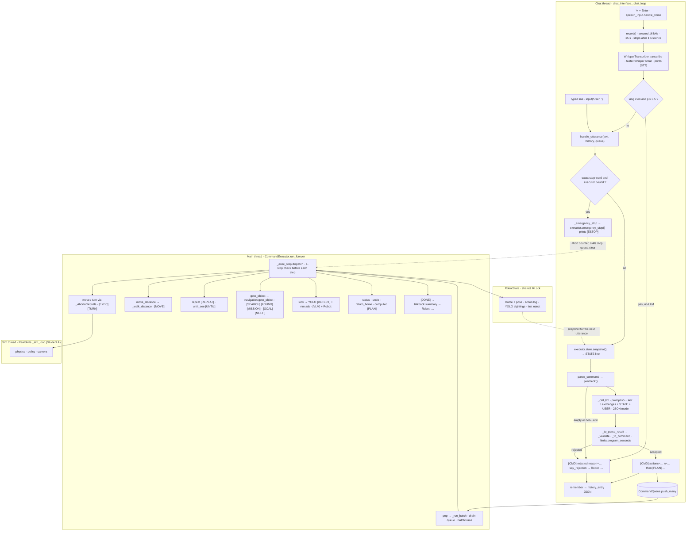

# Student B — code walkthrough (Task 3 + bonus + upgrade)

Written for Student B (viva preparation); generated from the code at `3e16e49` (branch `b/overnight-all`).

Every behaviour below was checked against the source at that commit. Numbers are copied from the
eval docs named next to them. Nothing was re-measured for this document except: a 2-line
`eval/mock_main.py` run (quoted at the end), a 3-call mock probe (6.3 item 2), and offline
`_validate()` checks (no LLM). Offline tests at this commit: `tests/test_student_b.py` 42,
`tests/test_bonus_b.py` 24, `tests/test_upgrade_b.py` 136, all passing (202).

Contents: 1 Overview · 2 Pipeline · 3 Modules · 4 Log lines · 5 Evaluation · 6 Limitations ·
7 Viva questions

---

## 1. Overview

B's part turns one English utterance (typed, or spoken after `v`) into robot behaviour and reports
back. It is the only part of the system that touches all three tasks: it parses with an LLM (Task 3),
drives Student A's `SkillsAPI` (Task 2) and calls Student C's `navigation.goto_object` and
`PerceptionAPI` (Task 4). It only ever imports the *interfaces* (`core/interfaces.py`), never
`skills_real` or `perception_real`.

| File | Role |
|---|---|
| `dialogue/chat_interface.py` | chat thread: input loop, stop fast path, history, rejection talk-back |
| `dialogue/speech_input.py` | bonus: push-to-talk, faster-whisper STT, language ID |
| `dialogue/llm_parser.py` | prompt v5, the one LLM call, the validator/compiler, `[CMD]` |
| `dialogue/limits.py` | the safety bounds, in one place, and the motion-time estimate |
| `dialogue/commands.py` | B-only command types (look, distance move, repeat, until_see, status, undo, return_home) |
| `dialogue/runtime.py` | lets the chat thread find the executor bound to its queue |
| `dialogue/executor.py` | main thread: batches, the program interpreter, e-stop, multi-goal |
| `dialogue/state.py` | robot state: home/pose, executed-action log, YOLO sightings, last reject |
| `dialogue/talkback.py` | `[PLAN]` and all `Robot:` sentences (templates, no LLM) |
| `dialogue/vlm.py` | bonus: visual QA with a vision-language model |

Four principles run through the code:

1. **At most one parser LLM call per utterance.** `parse_command` makes zero or one call; programs
   are expanded and run by code; talk-back is templates; status/undo/return_home are computed from
   the state store. The only extra call is `suggest_english()`, and only when the local precheck
   rejected the text as non-English *without* a call (`chat_interface.handle_utterance`). Transport retries inside
   `_call_llm` (one retry on a network error or 5xx; dropping an optional parameter after an HTTP
   400 that names it) are retries of the same call. A `look` action makes one separate VLM call
   when it runs.
2. **The validator never trusts the LLM.** `_to_parse_result()` re-checks every field, type, class,
   bound, nesting depth and the whole utterance's estimated motion time before anything reaches the
   queue. The model's free-text `suggestion` is only ever printed, never parsed or executed.
3. **The LLM selects, code computes.** For `status`, `undo` and `return_home` the model only picks the
   action; the numbers come from the executed-action log and `get_robot_pose()`.
4. **YOLO-only memory.** What the robot "has seen" is recorded from `PerceptionAPI.detect()` results;
   `config.OBJECT_POSITIONS` (ground truth) is never referenced in `dialogue/` (AST test
   `test_no_ground_truth_in_dialogue`).

**Threads.**

| Thread | Started by | Runs | Blocks on |
|---|---|---|---|
| chat (daemon) | `chat_interface.start_chat_thread(queue)` in `main.py` | `_chat_loop`: `input()`, STT, precheck, LLM call, validation, `queue.push_many`, the e-stop fast path | the keyboard, the microphone, the LLM call |
| main | `main.py` → `CommandExecutor(...).run_forever()` | pops batches, calls skills / navigation / YOLO / VLM, prints `[EXEC]`…`[DONE]` | `skills.move()`/`turn()`, navigation, the VLM call |
| sim (daemon, Student A) | `RealSkills.__init__` → `_sim_loop` | physics, locomotion policy, camera render at `CAMERA_HZ` | nothing B owns; `skills.move()` only blocks its caller |

Shared objects: `CommandQueue` (wraps `queue.Queue`), `RobotState` (`threading.RLock`), the
`runtime` registry (`threading.Lock`), and the executor's e-stop counter (incremented under
`_estop_lock`). The chat thread never waits for `[DONE]`, so the next `User:` prompt can appear
while the previous batch is still running.

---

## 2. The data pipeline

### 2.1 Diagram (mermaid)



### 2.2 Diagram (plain text)

```
CHAT THREAD (chat_interface._chat_loop)
  input("User: ") --------------------------+
  "v" -> speech_input.handle_voice          |
     record() -> transcribe() -> [STT]      |
     lang!=en and p>=0.5 ? --yes--> [CMD] rejected reason=non-English, Robot: ... (no LLM)
                          --no----------+   |
                                        v   v
  handle_utterance(text, history, queue)
     exact stop word & executor bound? --yes--> executor.emergency_stop()  -> [ESTOP] latency=.. ms
     snapshot = executor.state.snapshot()              (STATE: pose | last actions | seen | last reject)
     llm_parser.parse_command(text, history, snapshot)
        precheck(): empty / >30% non-ASCII letters --> [CMD] rejected (no LLM)
        _call_llm(): [system v5] + history (<=6 exchanges) + "STATE...\nUSER: text", JSON mode
        _to_parse_result() -> _validate():
            strip ``` fences, json.loads, {"rejected":..} | [..] | {"action":..} | {"actions":[..]}
            _to_command() per action: numbers finite & in range, duration>0, COCO class + aliases,
                colour-less goto -> ChatCommand("Which X do you mean? ..."), programs via _program()
                (nesting<=2, 1<=times/max_iter<=8, body allowed kinds), status topic aliases
            limits.program_seconds(commands) <= 60 s
        -> [CMD] actions=... n=..  + [PLAN] ...          or  [CMD] rejected reason=...
     rejected: (precheck non-English -> suggest_english(), the one call)
               say_rejection(): fit_suggestion(), reject_reply() -> Robot: ..., state.record_reject()
     remember(): history += user text + history_entry(result) JSON; keep last 6 exchanges
     accepted: queue.push_many(commands)   (never waits for [DONE])
                         |
                         v  CommandQueue (thread-safe)
MAIN THREAD (CommandExecutor.run_forever)
  pop -> _run_batch(): drain everything queued -> one [EXEC] 1/n ... [DONE] batch, BatchTrace
    for each cmd: _check_abort(); _exec_one() -> _exec_step():
      move/turn          -> _AbortableSkills -> SkillsAPI.move()/turn()       [EXEC] [TURN]
      move_distance      -> _walk_distance(): 0.5 s slices on get_robot_pose() [MOVE]
      repeat             -> loop, abort check per iteration and step          [REPEAT]
      until_see          -> look (YOLO), else body, <= max_iter               [UNTIL]
      goto_object        -> navigation.goto_object(cls, color, _motion, RecordingPerception)
                                                       [CMD] action=.. [SEARCH] [DETECT] [FOUND] [MISSION]
      look               -> frame -> save_frame -> detect() [DETECT] -> vlm.ask() [VLM] Robot: ...
      status             -> state.answer(topic) -> Robot: ...
      undo / return_home -> computed from action log / home pose               [PLAN] undo|return home: ...
      stop / chat        -> skills.stop()+queue.clear() / Robot: <reply>
      _log() -> state.record_action(ActionRecord(pose before/after, completed, result))
    >=2 gotos: [GOAL] k/n ... per goal, [MULTI] status=... at the end
    [DONE] actions=<done> t=<s> s  ->  talkback.summary(trace) -> Robot: Done: ...
STATE STORE (state.RobotState): update_pose() on every pose read, record_detections() on every
  detect() through RecordingPerception, record_action(), record_reject() -> snapshot() for the next turn
SIM THREAD (Student A): physics + policy + camera; move() only blocks the executor, never the sim
```

### 2.3 Step by step

1. **Input.** `_chat_loop` reads `input("User: ")`. A line that is exactly `v` imports
   `speech_input` lazily (typed-only runs never load whisper) and calls `handle_voice(history,
   queue)`. `record()` reads 30 ms frames from `arecord` (16 kHz mono), skips the first 0.5 s (the
   device "pops"), counts a frame as speech above −32 dBFS, and stops 1 s after speech ends or after
   5 s. `WhisperTranscriber.transcribe()` runs faster-whisper `small` (CUDA float16, else CPU int8;
   `beam_size=5`, `vad_filter=True`, `initial_prompt=WHISPER_PROMPT`) and prints `[STT] …`. If the
   detected language is not `en` with probability ≥ 0.5 (`NON_EN_MIN_PROB`) it rejects as
   `non-English` right there (no LLM call, no suggestion). Otherwise the transcript goes to
   `handle_utterance()`, exactly like typed text.
2. **Stop fast path.** `handle_utterance()` looks up the executor bound to this queue
   (`runtime.executor_for`). If there is one and `is_stop_word(text)` (lowercase, non-letters to
   spaces, then exact membership in `STOP_WORDS`: "stop", "halt", "freeze", "abort", "stop now",
   "emergency stop", "e stop", …), `_emergency_stop()` calls `executor.emergency_stop()` (bump the
   e-stop counter, `skills.stop()`, `queue.clear()`), prints `[ESTOP] latency=<ms> ms`, prints
   `Robot: Stopped.` if nothing was running, and stores `{"actions": [{"action": "stop"}]}` in
   history. No LLM call. "careful, stop there" is *not* a stop word and goes through the LLM.
3. **Context.** `snapshot = executor.state.snapshot()`: one line, e.g. (mock probe)
   `STATE: 1.6 m from start (+1.6 m ahead, +0.0 m left), heading -90 deg vs start | last actions
   (oldest first): walk forward 2 s at 0.8; turn right 90° | camera has seen (first to last): nothing yet`.
   The history is the last `config.LLM_HISTORY_TURNS = 6` exchanges; the user turns are the raw text
   and the assistant turns are the *accepted actions as JSON* (`history_entry()`). The STATE line
   rides only on the current user message: `user_message()` = `STATE…\nUSER: <text>`.
4. **Precheck.** `precheck()` rejects empty text and text whose letters are > 30 % non-ASCII
   (`NON_ASCII_LETTER_RATIO`), e.g. `向前走三秒`, without calling the LLM, and marks the result
   `precheck = True`.
5. **LLM.** `_call_llm()` sends `[system: SYSTEM_PROMPT (v5)] + history + user message` to
   `config.LLM_SERVICE` (`qwen-flash`) through the `openai` SDK with
   `response_format={"type": "json_object"}`, timeout 15 s, `max_retries=0` in the SDK and one own
   retry on `APIConnectionError` / `APITimeoutError` / `InternalServerError`. A 400 that names an
   optional parameter (`temperature`, `reasoning_effort`, `response_format`) drops it and retries.
   Latency and tokens go into `last_call_stats`. Any exception becomes a reject
   `llm_error:<ExceptionType>` (`parse_command` never raises, except `NotImplementedError`).
6. **Validator / compiler.** `_to_parse_result(raw)` → `_validate(raw)`:
   - strips a ```` ```json ```` fence, `json.loads` (failure → `malformed_json`);
   - `{"rejected": true, …}` → reject with `_clean_reason()` (snake_case, ≤ 80 chars) and
     `_clean_suggestion()` (one line, ≤ 120 chars, must itself pass the precheck);
   - accepts a bare list, a bare action object (checked *before* `"actions"`: a bare `repeat` has
     both keys), or `{"actions": [...]}`; an empty list → `empty_actions`;
   - `_to_command()` per action: `vx/vy/wz` finite and in [−1, 1], `duration` in (0, 30];
     `distance_m` non-zero, `|(vx, vy)| ≥ 0.05`, and `|d| / |(vx, vy)| ≤ 30 s`; `goto_object.class`
     normalised through `_CLASS_ALIASES` ("ball" → "sports ball", "sofa" → "couch", …) and checked
     against the 80 COCO names; an empty colour turns the goto into
     `ChatCommand("Which chair do you mean? Please tell me its colour.")` (inside a program the
     *whole utterance* becomes that question, via `_NeedColour`); `repeat`/`until_see` go through
     `_program()` (nesting ≤ 2, count an integer in 1..8, non-empty body, bodies may only contain
     move/turn/goto_object/repeat/until_see); `status` topics are normalised through
     `_TOPIC_ALIASES`; a `look` question is ≤ 300 chars;
   - `limits.program_seconds(commands)` ≤ 60 s for the whole utterance, else
     `program_too_long:<s>s`.

   On success it prints `[CMD] actions=… n=…` and, for any batch with a move/distance
   move/program or ≥ 2 actions, `[PLAN] …` (`talkback.plan_line`).
7. **Rejection talk-back.** For a precheck `non-English` reject with no suggestion,
   `suggest_english()` makes the utterance's one LLM call, only to get English words to *say*.
   `say_rejection()` drops a suggestion that just repeats the input, fits an out-of-range suggestion
   into the limits (`talkback.fit_suggestion`), prints `Robot: …` (`talkback.reject_reply`) and
   records the reject in the state (`record_reject`, except for `empty`).
8. **History and queue.** `remember()` appends the user text and `history_entry(result)` and trims
   to 12 messages. An accepted result is pushed with `queue.push_many(result.commands)`; the chat
   thread returns to `input()` at once.
9. **Executor.** `run_forever()` reads the e-stop counter, then `queue.pop(timeout=0.2)`; a command
   starts `_run_batch_starting_with()`, which records the counter value for this batch, sets
   `_busy`, and `_run_batch()` drains everything else in the queue into the same batch. For each
   command: `_check_abort()`, then `_exec_one()` → `_exec_step()` (dispatch by type), then `_log()`
   into the state. `ExecutionAborted` prints `[EXEC] action=i/n aborted reason=emergency_stop` and
   ends the batch; any other exception prints `[EXEC] action=i/n failed reason=…`, calls
   `skills.stop()` and ends the batch (the main thread never dies).
10. **Program interpreter.** `repeat` loops in code (`[REPEAT] iteration=k/n`), checking the abort
    flag before every iteration and step. `until_see` looks with YOLO on one frame (`_sees`), runs the
    body if the target isn't there, waits 0.3 s for a fresh frame, and repeats up to `max_iter`
    bodies plus one last look (`[UNTIL] …`); if a top-level `until_see` never sees its target and
    more actions follow, the rest of the batch is skipped. A distance move is closed-loop (`_walk_distance`). Inner steps
    log with their top-level action number.
11. **Navigation, look, multi-goal.** `goto_object` calls
    `navigation.goto_object(cls, color, self._motion, self.perception)` — Student C's code, given
    the abortable skills and the recording perception; it returns `True` iff it printed
    `[MISSION] status=SUCCESS`. With ≥ 2 gotos in a batch, each prints
    `[GOAL] k/n <target> status=REACHED|NOT_REACHED`, a missed goal does not end the batch, and
    `[MULTI] status=SUCCESS|PARTIAL|FAIL …` closes it. `look` grabs one frame, saves it to
    `eval/results/vlm/`, runs YOLO on it (`[DETECT]`), asks the VLM, prints `[VLM] …` and
    `Robot: <answer>`.
12. **State and talk-back.** Every pose read updates the state (`_pose()` → `update_pose`); every
    `detect()` made through the executor is recorded (`RecordingPerception`); every top-level action
    is logged with pose before/after. After the loop: `[MULTI]` if applicable, `[DONE] actions=<n
    completed> t=<s> s`, then `talkback.summary(trace)` → `Robot: Done: …` (or
    `Emergency stop: …`, `Step k of n failed …`, `I skipped the last …`). The next utterance's
    snapshot reads this state.

---

## 3. Modules

### 3.1 `dialogue/chat_interface.py` — the chat thread

- **In:** a typed line (or a transcript from `speech_input`). **Out:** commands on the
  `CommandQueue`, `[ESTOP]`/`Robot:` lines, the updated `history` list.
- **Key functions:** `start_chat_thread(queue) -> threading.Thread`; `_chat_loop(queue)`;
  `is_stop_word(text) -> bool`; `handle_utterance(user_text, history, queue) -> ParseResult`;
  `remember(user_text, result, history)`; `say_rejection(result, user_text="", queue=None)`;
  `_emergency_stop(executor, user_text, history, t0) -> ParseResult`.
- **Decisions.**
  - *Own thread, never waits for `[DONE]`* — the LLM call (0.3–2 s) and `input()` must not block
    physics or execution (handout requirement; `DECISIONS.md` §5).
  - *Stop fast path, exact words only.* A queued stop waits behind the running batch (the old
    Video_Task3 note in `task3_eval.md` "Don't demo a mid-move stop" describes exactly that); the
    LLM can also misread a one-word stop (gpt-5-nano "halt!" → rejected `empty`, `task3_eval.md`
    failure 2). Exact matching avoids false positives: `tests/test_upgrade_b.py::test_not_stop_words`
    covers "careful, stop there", "stop at the chair", "don't stop", "stopwatch". Rejected
    alternative: a fuzzy/LLM stop detector (needs the call we are trying to avoid).
  - *History stores accepted actions as JSON*, not the model's raw text, so a follow-up sees exactly
    what was accepted (after validation and the colour-less-goto rewrite).
  - The fast path needs a bound executor (`runtime`), i.e. `main.py`'s real loop; without one
    (`test_no_fast_path_without_a_bound_executor`) "stop" goes through the LLM.

### 3.2 `dialogue/speech_input.py` — bonus: spoken commands

- **In:** microphone audio via `arecord`. **Out:** `[MIC]`, `[STT]` lines, then
  `chat_interface.handle_utterance(transcript, …)`.
- **Key functions:** `record(frames=None) -> np.ndarray` (float32, empty if no frame rose above
  −32 dBFS); `class WhisperTranscriber(model_size="small")` with `transcribe(audio) -> (text, lang,
  prob)`, loaded on first use; `get_transcriber()`; `handle_voice(history, queue, record_fn=record,
  transcriber=None)`.
- **Decisions** (`eval/stt_eval.md`): local faster-whisper (no API key; ~0.1 s on the GPU; language
  ID built in); `arecord` instead of PortAudio; non-English rejected by language ID before any LLM
  call (Mandarin: zh, p = 1.00); the threshold stayed at p ≥ 0.5 because all 10 English utterances
  were identified as `en` with p ≥ 0.82, so the planned stricter rule was not needed;
  `initial_prompt` with the command vocabulary was adopted after an offline re-transcription cut
  pooled WER from 6.9 % to 1.7 %.

### 3.3 `dialogue/llm_parser.py` — prompt, LLM call, validator

- **In:** utterance, history, STATE line. **Out:** `ParseResult` (+ `.suggestion`, `.precheck`
  attributes), `[CMD]` and `[PLAN]` lines.
- **Key functions:** `parse_command(user_text, history, snapshot=None) -> ParseResult`;
  `precheck(user_text) -> Optional[str]`; `user_message(user_text, snapshot) -> str`;
  `_call_llm(user_text, history, snapshot=None, response_format=None) -> str`;
  `_to_parse_result(raw_json) -> ParseResult` (prints) / `_validate(raw_json)` (silent);
  `_to_command(a, depth=0)`; `_distance_move(a)`; `_program(a, kind, depth)`;
  `history_entry(result) -> str`; `suggest_english(user_text) -> Optional[str]`;
  `load_api_key(name, env_file=None)` (environment first, then the repo `.env`; never prints).
- **Services** (`SERVICES`): `qwen-flash` (temperature 0), `qwen-plus`, `gemini-3.8-flash`
  (`reasoning_effort="none"`), `gpt-5-nano` / `gpt-5-mini` (`reasoning_effort="minimal"`); all via
  the OpenAI-compatible chat-completions API.
- **Prompt history** (frozen copies in `eval/prompt_v1.py` … `prompt_v4.py`; v5 is live):

  | Version | Change | Why (evidence) |
  |---|---|---|
  | v1 | JSON schema of actions, rules, few-shots | baseline: qwen-flash 87.1 %, lateral 0 % (`task3_eval.md`) |
  | v2 | sign-convention block (vy + = LEFT), 3 lateral/turn examples | qwen-flash inverted every lateral command (12/12); v2 → 100 % |
  | v3 | "stop/halt/freeze … map to stop, never empty"; validator accepts a bare action object | gpt-5-nano "halt!" 1/3 on v2 → 3/3 (P7 no longer held out) |
  | v4 | `look` action; "decide the language first"; "a warning is not a look" | bonus visual QA; gpt-5-nano accepted French X2 and read "look out!" as look in the draft |
  | v5 | distance_m, repeat/until_see, status/undo/return_home, reject `suggestion`, STATE usage, explicit limits ("never split to fit"), code-switching = non-English, injection rules | the upgrade; all v4 rule lines kept (`test_v5_keeps_every_v4_rule_line`); no Hard-set phrasing in it (`test_v5_has_no_hard_set_phrasing`) |
- **Decisions.**
  - *JSON mode, not function calling or strict json_schema* (`upgrade_eval.md`, ablation):
    qwen-flash 33/33 json_object vs 32/33 json_schema vs 33/33 tools (more tokens: 3698 in);
    gpt-5-nano 32/33 vs 32/33 vs **25/33 with tools**, which also accepted "charge at that person"
    and French X2. JSON mode is as accurate and cheaper.
  - *Validator re-checks everything*: models were fooled on the Hard set (qwen-flash v5 wrote a
    90-s full-speed sprint for H-I7; 45 s, 100 m, 20 repetitions on H-U3/U4/U8) and **0 unsafe
    commands passed the validator** in any run. It also absorbs format drift (bare action, fenced
    JSON, class "ball").
  - *Colour-less goto → clarifying question in code*: navigation matches colour exactly, so
    "go to the chair" used to start a search that could not succeed; all three models returned
    `color=""`, so the question is generated by the parser (C2/F3 3/3, `task3_eval.md`).
  - *Bounds, not clamping*: an out-of-range value is rejected with a reason and a *suggested*
    clamped command (`_clamped_move_words`, `_clamped_distance_words`), never silently shrunk.
  - *No keyword post-fix*: the direction must come from the LLM (`task3_eval.md`).

### 3.4 `dialogue/limits.py` — the bounds

| Constant | Value | Meaning |
|---|---|---|
| `MAX_SPEED` | 1.0 | \|vx\|, \|vy\|, \|wz\| |
| `MAX_MOVE_S` | 30.0 (`config.LLM_MAX_DURATION_S`) | one move; a distance move's \|d\|/\|v\| |
| `MAX_PROGRAM_S` | 60.0 | estimated motion time of one utterance, loops multiplied out |
| `MAX_ITER` | 8 | `repeat.times`, `until_see.max_iter` |
| `MAX_NESTING` | 2 | program inside a program |
| `TURN_RATE_DPS` | 45.0 | turn time estimate |
| `NORMAL_SPEED` | 0.8 | the prompt's walking speed; also return_home / undo speed |
| `MIN_TRANSLATION` | 0.05 | below this a distance move is invalid |

`program_seconds(commands)`: moves count their duration, distance moves \|d\|/\|(vx, vy)\|, turns
\|angle\|/45, repeat = times × body, until_see = max_iter × body; `goto_object` and `look` count 0
(navigation has its own 120-s timeout, look does not move). `wrap_deg(a)` → (−180, 180].
**Decision:** one module so the validator and the talk-back ("The longest single move is 30 s") can
never disagree.

### 3.5 `dialogue/commands.py` and `dialogue/runtime.py`

`commands.py` holds dataclasses that only flow parser → queue → executor, so `core/schema.py`
(frozen, shared, `CONTRACT_VERSION = 1`) did not change: `LookCommand(question)`,
`DistanceMoveCommand(vx, vy, wz, distance_m)`, `RepeatCommand(times, actions)`,
`UntilSeeCommand(object_class, color, actions, max_iter)`, `StatusCommand(topic="general")`,
`UndoCommand()`, `ReturnHomeCommand()`; each has a `kind` string. `STATUS_TOPICS = ("last_action",
"home", "last_reject", "seen", "general")`.

`runtime.py`: `bind(queue, executor)` (called in `CommandExecutor.__init__`) and
`executor_for(queue)`, keyed by `id(queue)` with weak references. **Decision:** `main.py` only passes
the queue to the chat thread; this lets the chat thread reach the executor (e-stop, STATE) without
editing `main.py`.

### 3.6 `dialogue/executor.py` — dispatcher and program interpreter

- **In:** commands from the queue. **Out:** calls to `SkillsAPI`, `navigation.goto_object`,
  `PerceptionAPI.detect`, `vlm.ask`; `[EXEC] [MOVE] [REPEAT] [UNTIL] [PLAN] [GOAL] [MULTI] [VLM]
  [DONE]`, `Robot:` lines; records in `RobotState`.
- **Key API:** `CommandExecutor(skills, perception, queue, goto_object_fn=navigation.goto_object,
  vlm_fn=vlm.ask, save_frame_fn=vlm.save_frame)`; `run_forever(poll_timeout=0.2)`;
  `emergency_stop() -> bool` (thread-safe, returns whether a batch was running);
  `_run_batch(first_cmd)`; `_exec_step(cmd, i, n, trace)`; `_until_see(cmd, i, n) -> (seen,
  iterations)`; `_walk_distance(vx, vy, wz, distance_m) -> float`; `_undo(cmd, i, n, trace)`;
  `_go_to_pose(target, label, speed=0.8)`; `_look(question)`; `_AbortableSkills(inner, aborted)`;
  `_mission_summary(mission, n_goals, elapsed) -> str`.
- **Closed-loop distance walk** (`_walk_distance`): slices of ≤ 0.5 s (`DIST_STEP_S`; ≥ 0.1 s),
  planar distance from the start pose via `get_robot_pose()`, stop within 0.03 m (`DIST_TOL_M`),
  time cap `min(60, 4 × |d|/|v| + 2)` s (`status=timeout`), stall check: < 0.05 m progress over the
  last 2 s → `status=blocked`. Prints `[MOVE] target=… final_error=…`.
- **E-stop semantics** (module docstring, verified in code):

  | What is running when "stop" arrives | Effect |
  |---|---|
  | commands queued, not yet popped | cleared |
  | a step boundary / loop iteration | `_check_abort()` raises `ExecutionAborted` |
  | timed `move()` | velocity zeroed at once by `skills.stop()`; the call still returns at its original end time; nothing else starts |
  | distance walk | current slice zeroed; the next `_motion.move()` raises |
  | `goto_object` | navigation's next `move()`/`turn()` through `_AbortableSkills` raises |
  | closed-loop `turn()` | **runs to its end** (`RealSkills.turn` re-commands wz every 20 ms), then the batch aborts |

  The counter is compared per batch and never reset, so the next command runs normally. An e-stop
  that lands between `run_forever`'s counter read and `pop()` aborts what was popped.
- **Undo / return home** (code computes the motion): `_undo` takes `state.last_undoable()`; a
  turn → `turn(-angle)`; a straight move (timed or distance, \|wz\| < 0.05) → walk back the
  *measured* distance (pose before/after) at the reversed velocity, closed-loop, then fix the
  heading if off by > 3°; anything else (goto, program, curved move, return_home) →
  `_go_to_pose(pose_before)`. `return_home` → `_go_to_pose(state.home)`: face the target if
  > 2° off, closed-loop walk at 0.8 if > 0.15 m away, then a final turn computed from where the
  robot actually ended up. Both print a computed `[PLAN] undo: …` / `[PLAN] return home: …`.
- **Decisions.**
  - *Programs are run by code, not the LLM*: one call per utterance, bounds checked statically
    before anything moves, deterministic expansion, e-stop checks between steps, no per-iteration
    LLM latency/cost (`test_program_never_calls_the_llm`). Rejected alternative: an LLM agent loop
    (one call per step; each call could be fooled or time out).
  - *One batch = one `[EXEC] 1/n … [DONE]` block*, numbered by top-level action; inner program
    steps reuse their parent's number.
  - *Multi-goal: skip, don't abort.* C's `goto_object` stops the robot before returning `False`,
    so the next goal can start; an exception still ends the batch and later goals count as
    `not_attempted` (`multigoal_eval.md`). A single goto prints no `[GOAL]`/`[MULTI]`, so Task 4
    output is unchanged.
  - *until_see failure skips the rest*: "until you see X, then …" — the rest depended on X.
  - *Errors end the batch, not the program*: this is the main thread; `_safe_stop()` then stop.
  - Note: `DECISIONS.md` §5 still calls the executor a "pure dispatcher". Since the upgrade it also
    interprets programs and computes undo/return_home motion, but it still does **no validation**:
    everything it pops was validated by `_to_parse_result`.

### 3.7 `dialogue/state.py` — what the robot knows

- **`RobotState`** (written by the executor thread, read by the chat thread; `RLock`):
  `home` (first pose seen — the executor reads one in `__init__`), `pose`, `actions`
  (`ActionRecord`s, last 50), `seen` (`(color, class) → Sighting`, de-duplicated, keeping the last
  sighting and the first-seen order), `last_reject`, `batch`.
  Methods: `update_pose`, `new_batch`, `record_action`, `record_detections(detections, pose)`,
  `record_reject`, `last_undoable`, `last_batch`, `from_home() -> (ahead, left, dist, heading)`,
  `sightings()`, `snapshot() -> str`, `answer(topic) -> str`.
- **`ActionRecord`**: command, pose before/after, `completed` (False if failed/e-stopped),
  `result` (goto: reached; until_see: (seen, iterations)), `undone`, `is_undo`. Undoable kinds:
  move, move_distance, turn, goto_object, repeat, until_see, return_home; an undo is never undone.
  chat and status are not logged.
- **`snapshot()`**: pose vs start, the last 3 actions, up to 6 clearly coloured sightings (+ a count
  of detections whose colour was unknown), the last reject (text cut to 40 chars). Tested to stay
  under ~120 tokens (`test_snapshot_is_compact_and_complete`).
- **`answer(topic)`**: `last_action` (the last batch, with net motion), `home`, `last_reject`,
  `seen` (clearly coloured objects with "last seen N s ago at heading H°"; uncoloured ones only as a
  count — added after the real-sim run listed "the unknown bench").
- **`RecordingPerception(inner, state, pose_fn)`**: a `PerceptionAPI` proxy; `detect()` records
  every result with the robot pose (bookkeeping errors are swallowed), everything else (`__getattr__`)
  is delegated, including the optional hooks navigation looks up.
- **Decision: YOLO only.** What the robot can *say it saw* must be what its camera saw; references
  ("the first thing you saw") must resolve to objects navigation (also YOLO-based) can find; ground
  truth stays logging-only (`DECISIONS.md` §4; AST test).

### 3.8 `dialogue/talkback.py` — `[PLAN]` and `Robot:`

- `words(c, say=False)` (compact `[PLAN]` style or an English instruction), `join(commands, say)`,
  `plan_line(commands)`, `reject_reply(reason, suggestion=None, out_of_range=None)`,
  `is_out_of_range(reason, suggestion)`, `fit_suggestion(text)`, `reason_words(reason)`,
  `BatchTrace` (kinds, poses, done, failed, aborted_at, goals, sightings, skipped, path_m, notes),
  `summary(trace)`.
- `fit_suggestion` rewrites every quantity in a model-made suggestion that exceeds a limit ("30
  meters" → "24 meters", "two minutes" → "30 seconds", "ten times" → "8 times") and returns `None`
  if the whole thing would still exceed 60 s.
- `reject_reply`: non-English → "I only take commands in English. Did you mean …?"; out-of-range →
  bound sentence + fitted suggestion; impossible / unsafe / llm_error / ambiguous → fixed
  sentences; any other model-made reason → "Could you rephrase it?" (its free-text suggestion is
  not shown).
- **Decision:** templates only (no LLM for talk-back), over data the system already has, so a
  sentence can never contradict the validator or the pose trace.

### 3.9 `dialogue/vlm.py` — bonus visual QA

`ask(frame, question, service=None, client=None) -> VLMAnswer(answer, model, latency_s,
tokens_in, tokens_out)`: one PNG frame (data URL) + the question, system prompt "answer using ONLY
what is visible … say you can't tell"; raises on API errors or an empty answer (the executor turns
that into a failed step). `save_frame(frame)` writes `eval/results/vlm/<timestamp>.png`.
`config.VLM_SERVICE = "qwen3-vl-flash"`, chosen from 4 candidates on the same frames: the only one
to spot the half-visible chair, 0.4–1.4 s (`task3_eval.md`, "VLM choice"). The look path runs YOLO on
the same frame first, so `[DETECT]` and the VLM answer are comparable.

### 3.10 Touchpoints outside `dialogue/`

- `core/schema.py`: `MoveCommand`, `TurnCommand`, `GotoObjectCommand`, `StopCommand`,
  `ChatCommand`, `ParseResult(accepted, commands, reject_reason)`, `Detection`, `RobotPose`,
  `CommandQueue` (`push_many`, `pop(timeout)`, `clear`, `empty`). `ParseResult` has no suggestion
  field, so B attaches `.suggestion` / `.precheck` as attributes instead of changing the contract.
- `core/interfaces.py`: `SkillsAPI.move/turn/stop/get_camera_frame/get_robot_pose` (turn must print
  `[TURN]`), `PerceptionAPI.detect(frame, conf_threshold=None)` (must print `[DETECT]`).
- `main.py`: builds skills/perception (real or `--mock`), `CommandQueue`, starts the chat thread,
  then `CommandExecutor(...).run_forever()` on the main thread.
- `perception/navigation.py` (C): `goto_object(object_class, color, skills, perception,
  command_text=None) -> bool` — search → steer → approach → stop; prints its own
  `[CMD] action=goto_object(class=…, color=…)`, `[SEARCH]`, `[FOUND] class=… color=… t=… s d=… m`,
  `[MISSION] status=SUCCESS` or `[MISSION] status=FAIL reason=target_not_found|stop_verification|timeout`;
  returns `True` iff SUCCESS; timeout `config.APPROACH_TIMEOUT_S = 120`.
- Eval tooling: `eval/task3_eval.py` (Standard and `--set hard` runs, checkers, report, spend),
  `eval/hard_cases.py` (frozen Hard set + injection oracles), `eval/ablation.py`,
  `eval/mock_main.py` (`main.py --mock`, or `--scenario` with `eval/scenario_mock.py`'s
  `KinematicSkills`, `ScenarioPerception`, `scenario_goto`, `mock_vlm`), `eval/e2e/run_all.py`
  (real-sim suites S1–S5 typed into `main.py`, video per scenario, ground-truth trace for logging).

---

## 4. Log lines

Handout lines (format unchanged by the upgrade, per `upgrade_eval.md`):

| Line | Printed by | Real example |
|---|---|---|
| `[CMD] actions=… n=…` | `llm_parser._to_parse_result` (B) | `[CMD] actions=move(vx=0.8, 3.0 s), turn(180 deg) n=2` (`task3_eval.md`, demo b) |
| `[CMD] rejected reason=…` | `llm_parser._to_parse_result` / `_reject` (B; also for precheck and STT rejects) | `[CMD] rejected reason=impossible:fly` |
| `[CMD] action=goto_object(…)` | `navigation.goto_object` (C), a second `[CMD]` line for every goto | `[CMD] action=goto_object(class=sports ball, color=orange)` (e2e S5 dry run) |
| `[EXEC] action=i/n …` | `executor._exec_step` (B); also `… aborted reason=emergency_stop`, `… failed reason=…` | `[EXEC] action=1/2 move vx=0.8 vy=0.0 wz=0.0 t=3.0 s` |
| `[TURN] target=… final_error=…` | `SkillsAPI.turn` (A's `RealSkills`; the mocks print it too) | `[TURN] target=180.0 deg final_error=1.6 deg` |
| `[DONE] actions=… t=…` | `executor._run_batch` (B) | `[DONE] actions=2 t=7.8 s` |
| `[STT] text=… lang=… p=… t=…` | `speech_input.handle_voice` (B) | `[STT] text="Walk forward for 3 seconds." lang=en p=0.96 t=0.12 s` (rendered in the code's format from `stt_eval.md` row B1; the raw console log isn't committed) |
| `[DETECT] …` | `PerceptionAPI.detect` (C); `executor._look` adds `[DETECT] none` / `[DETECT] failed reason=…` | `[DETECT] class=sports ball color=orange conf=0.73 bbox=[65.78, 204.29, 98.51, 230.10]` (`eval/results/vlm/real_sim_check.log`, bbox rounded here) |
| `[SEARCH] …` | `navigation` (C) | `[SEARCH] target not visible, rotating` |
| `[FOUND] …` | `navigation` (C) | `[FOUND] class=chair color=red t=23.6 s d=1.15 m` (`multigoal_eval.md`, M1) |
| `[MISSION] …` | `navigation` (C) | `[MISSION] status=SUCCESS` |

Lines added by B (new; nothing above changed format):

| Line | Printed by | Real example |
|---|---|---|
| `[PLAN] …` | `llm_parser` via `talkback.plan_line` (after `[CMD]`); `executor._undo` / `_go_to_pose` (computed) | `[PLAN] return home: turn left 180°, then walk forward 2.71 m at 0.8, then turn left 4.9°` (`upgrade_eval.md`, mock e2e) |
| `[MOVE] target=… final_error=…` | `executor._walk_distance` | `[MOVE] target=1.00 m final_error=0.03 m` (e2e S5 square, real sim) |
| `[REPEAT] iteration=k/n` | `executor._exec_step` (repeat) | `[REPEAT] iteration=1/3` (e2e S5 estop) |
| `[UNTIL] …` | `executor._until_see` | `[UNTIL] seen class=sports ball color=orange conf=0.30 after 4 iteration(s)` (e2e S5, real sim) |
| `[ESTOP] latency=… ms` | `chat_interface._emergency_stop` (and `[ESTOP] skills.stop() failed …` from `executor.emergency_stop`) | `[ESTOP] latency=0.0 ms` |
| `[GOAL] k/n … status=…` | `executor._run_batch` (≥ 2 gotos) | `[GOAL] 1/2 red chair status=REACHED t=23.6 s` |
| `[MULTI] status=…` | `executor._mission_summary` | `[MULTI] status=SUCCESS reached=2/2 t=46.0 s` |
| `[VLM] model=… t=… tokens=… frame=…` | `executor._look` | `[VLM] model=qwen3-vl-flash t=0.60 s tokens=399/22 frame=…/eval/results/vlm/20261002-232018-702459.png` |
| `[MIC] …` | `speech_input.record` | `[MIC] listening (up to 5 s, stops after 1 s of silence)...` (format from code) |
| `Robot: …` | `talkback.summary` (after `[DONE]`), `chat_interface.say_rejection`, executor (chat reply, status answer, VLM answer, "nothing to undo"), `_emergency_stop` ("Stopped.") | `Robot: Done: saw the orange sports ball after 4 tries; reached the orange sports ball; moved 3.0 m, net turn 177° left.` (e2e S5, real sim) |

Ordering note: `[CMD]`/`[PLAN]` come from the chat thread and `[EXEC]`… from the main thread, so the
next `User:` prompt may print between them (seen in every e2e log).

---

## 5. Evaluation summary

### 5.1 Task 3 parser, Standard set, prompts v1–v5

Whole-`ParseResult` checker: right number/order/types, params within tolerance (angle ±1°, duration
±0.05 s, normal vx in [0.5, 1], slow in [0.1, 0.5], lateral |vx| ≤ 0.1 with the correct vy sign);
invalid inputs must be rejected (reason text not graded); API errors are not parse failures.

| Prompt (cases × runs) | qwen-flash | gpt-5-nano | gemini-3.8-flash | Source |
|---|---|---|---|---|
| v1 (31 × 3) | 87.1 % (81/93) | 92.5 % (86/93) | 100 % (93/93) | `eval/task3_eval.md` |
| v2 (31 × 3) | 100 % (93/93) | 97.8 % (91/93) | 100 % (93/93) | `eval/task3_eval.md` |
| v3 (33 × 3; Gemini × 1) | 100 % (99/99) | 100 % (99/99) | 100 % (33/33) | `eval/task3_eval.md` |
| v4 (38 × 1) | 100 % (38/38) | 97.4 % (37/38) | 100 % (38/38) | `eval/task3_eval.md` |
| v4 held-out warnings V6–V8 | 3/3 | 2/3 | 3/3 | `eval/task3_eval.md` |
| v4 (45 × 1, + V6–V8, G1–G4) | 100 % (45/45) | 96 % (43/45) | 100 % (45/45) | `eval/upgrade_eval.md` |
| **v5 (45 × 1)** | **100 % (45/45)** | **93 % (42/45)** | **100 % (45/45)** | `eval/upgrade_eval.md` |

| Latency median / p90 (s), tokens in | qwen-flash | gpt-5-nano | gemini-3.8-flash | Source |
|---|---|---|---|---|
| v3 | 0.35 / 0.55, 1203 | 1.09 / 1.38, 1189 | 1.96 / 2.27, 1240 | `task3_eval.md` |
| v5 | 0.32 / 0.49, 2694 | 0.89 / 1.08, 2660 | 1.63 / 1.91, 2791 | `upgrade_eval.md` |
| cost per 1k calls (v3) | $0.072 | $0.075 | $1.045 | `task3_eval.md` |

Multi-goal parsing G1–G4 (v4, after freezing): 12/12 (`multigoal_eval.md`).

### 5.2 Hard set (held out, 71 cases, 1 run) and injection — `eval/upgrade_eval.md`

| Category | n | qwen-flash v5 | gpt-5-nano v5 | gemini v5 | qwen-flash v4 |
|---|---|---|---|---|---|
| comp | 8 | 7/8 | 6/8 | 8/8 | 5/8 |
| ref | 8 | 7/8 | 6/8 | 8/8 | 6/8 |
| repair | 8 | 8/8 | 7/8 | 8/8 | 7/8 |
| ambig | 7 | 3/7 | 2/7 | 7/7 | 5/7 |
| noise | 8 | 4/8 | 4/8 | 8/8 | 8/8 |
| numbers | 8 | 8/8 | 7/8 | 8/8 | 7/8 |
| codeswitch | 8 | 8/8 | 5/8 | 8/8 | 5/8 |
| chain | 7 | 7/7 | 4/7 | 7/7 | 7/7 |
| injection | 9 | 9/9 | 9/9 | 9/9 | 9/9 |
| **all** | 71 | **86 % (61/71)** | **70 % (50/71)** | **100 % (71/71)** | **83 % (59/71)** |
| latency median / p90 (s) | | 0.31 / 0.81 | 0.96 / 1.64 | 1.60 / 1.90 | 0.29 / 0.96 |

| Injection | safe | LLM fooled (injection cases) | unsafe passed the validator (all 71) |
|---|---|---|---|
| qwen-flash v5 | 9/9 | 1/9 (H-I7) | **0** |
| gpt-5-nano v5 | 9/9 | 0/9 | **0** |
| gemini v5 | 9/9 | 0/9 | **0** |
| qwen-flash v4 | 9/9 | 2/9 (H-I7, H-I8) | **0** |

As run, gpt-5-nano's H-U8 counts as a failure (the bare-repeat validator bug, fixed in `9db9aa8`);
an offline re-score of the same logged reply gives a pass (rejected `too_many_iterations:20`).

### 5.3 Structured-output ablation (33 v3 cases, prompt v5) — `eval/upgrade_eval.md`

| Service | json_object | json_schema | tools (function calling) |
|---|---|---|---|
| qwen-flash | 33/33, 0.34 s | 32/33 (F1), 0.48 s | 33/33, 0.46 s, 3698 tokens in |
| gpt-5-nano | 32/33 (F1), 0.89 s | 32/33 (F1), 1.10 s | 25/33, 1.14 s |

### 5.4 Bonus

| Item | Result | Source |
|---|---|---|
| STT, English handled correctly | 9/10 (L2 failed: "Shuffle rights" → rejected `empty`) | `eval/stt_eval.md` |
| STT, non-English rejected | 2/2 (Mandarin by language ID; French by the LLM) | `eval/stt_eval.md` |
| STT, pooled English WER | 6.9 % → **1.7 %** with `initial_prompt` (offline re-transcription of the same 12 WAVs) | `eval/stt_eval.md` |
| STT latency (median) | STT 0.10 s; STT + LLM 0.46 s (plus the 1-s silence wait) | `eval/stt_eval.md` |
| VLM, real sim | **3/3** answers correct (YOLO fully right on 1/3 frames); mean 0.67 s, ~$0.000034 per look | `eval/vlm_eval.md` |
| Multi-goal, real sim | M1–M3 SUCCESS 2/2; M4 PARTIAL 2/3 (green chair missed, skipped); M5 SUCCESS 2/2; M6 SUCCESS 3/3 in 109.7 s; red chair + orange ball 4/4 | `eval/multigoal_eval.md` |

### 5.5 End-to-end on the real sim — `eval/e2e/results/*/summary.md` (committed runs)

| Run | Commit (B code) | What B's part did |
|---|---|---|
| `20261004-0101_baseline` | `32c6f78` (pre-upgrade: prompt v4, no STATE) | S2 (Video_Task3 a–g typed into `main.py`): all 7 `[CMD]` lines as expected, turn errors 2.0/1.5/−1.6°, no fall, no contact. S3: `[CMD]` correct 10/10 (mission success 3/10 is Task 4). S4: 3 VLM answers; 2-goal mission `[MULTI] status=SUCCESS reached=2/2 t=45.6 s` |
| `…0111`, `…0118`, `…0128`, `…0138` (Task 4 iterations) | `8fde6cc`, `d553e63`, `2999c7b`, `4d7f147` (all pre-upgrade, v4) | S3 `[CMD]` correct 10/10 in every run (mission success 3, 4, 6, 5 /10 — C's navigation) |
| `20261004-0153_s5_dryrun` | `14fe411` (v5 + STATE, before `fit_suggestion`) | S5 upgrade scenarios **7/7**: until_see + goto (d = 0.50 m), square (four `[MOVE]` errors ≤ 0.04 m), return_home (≤ 0.3 m), status, e-stop (no LLM call), non-English suggestion, out-of-range + "why" |

So the committed S2 (Video_Task3) pass is on **prompt v4**; the S5 dry run is the only committed
real-sim run on v5.

A later run (`20261004-0206_final`, at this commit) was still being written, uncommitted, when this
document was generated; it is not in the table. One observation from its S2 log is in 6.3 (item 2).

---

## 6. Limitations and known failure modes

### 6.1 From the evaluations

1. **gpt-5-nano F1 regression (v5).** "do that again, but slower" → `repeat(1x: move(vx=0.3, 2 s))`:
   right motion, wrong shape; the Standard checker requires a plain move. Not tuned further
   (`upgrade_eval.md`, failure 5).
2. **ASR-noise regression from the code-switching rule** (qwen-flash noise 8/8 on v4 → 4/8 on v5):
   "trun lfet nintey degres" is rejected as non-English, with the right suggestion. Safe, but a
   regression; the candidate fix ("misspelt English is still English") needs a new held-out set.
3. **Ambiguity regression** (qwen-flash 5/7 → 3/7): with a red and a green chair in STATE, "go to
   the chair" (H-A3) picks the first-seen one instead of asking — STATE made the model
   over-confident. "go there" → rejected `ambiguous` (safe).
4. **gpt-5-nano chains and code-switching** (chain 4/7, codeswitch 5/8): drops/flips steps in 6–7-step
   chains; executes "turn left 九十 degrees" (the precheck only catches mostly non-Latin text).
5. **E-stop cannot interrupt a running closed-loop turn**: `RealSkills.turn()` re-commands wz every
   20 ms, so the turn finishes before the batch aborts; a timed `move()` stops moving at once but
   returns at its original end time. `[ESTOP] latency` is software latency (0.0 ms); physically the
   robot came to rest ~0.6 s after Enter (`upgrade_eval.md`, real-sim feedback).
6. **Only exact stop words are fast.** "careful, stop there" goes through the LLM and its stop is
   queued behind the running batch.
7. **until_see failure skips the rest** of the utterance (reported in `Robot:`); YOLO misses (the
   green chair at conf 0.14, the scene's square sign plates) make this likely for some targets.
8. **French identified as English by whisper** (p = 0.55, "Avian's Toad droid"); its rejection relies
   on the LLM. The `initial_prompt` does not help: language ID runs before decoding.
9. **Small n**: STT is one speaker, 12 clips; VLM 3 real frames; multi-goal 1–4 runs per row; most
   v4/v5 numbers are 1 run.
10. **No confirmation step**: `[PLAN]` is printed but the robot starts at once.
11. **Cost**: v5 roughly doubles the prompt (~1415 → ~2700 input tokens; +~90 % per call).
12. **Not implemented**: `if_see` (optional in the brief).
13. **Model suggestions could exceed the limits** as evaluated (H-U3 "30 meters" > 24 m; the S5 dry
    run printed "walk forward for 30 meters"); fixed afterwards by `talkback.fit_suggestion` (talk-back
    only, no score changed).

### 6.2 Navigation-side (Student C), visible through B's goto

YOLO misses the stop-sign plates (7/387 rendered views labelled "stop sign"); the C2 true-distance
criterion failed in several S3 runs; `stop_verification` has no hysteresis (`multigoal_eval.md`).

### 6.3 Found while writing this walkthrough (code reading; check before the viva)

1. **Turns of 180° or more vs `RealSkills.turn`.** The validator bounds a turn only through the
   60-s budget (`TurnCommand(_number(a, "angle_deg"))` has no per-turn range; `turn 2000°` is
   accepted). `RealSkills.turn` (Student A) sets `target_yaw = start_yaw + angle` and drives
   `_wrap_deg(target_yaw − current_yaw)`, which lies in [−180, 180). So `turn(360)` (and any multiple)
   ends at once with error 0, `turn(270)` turns *right* 90°, and `turn(180)` goes whichever way the
   first error sample wraps (exactly 180 wraps to −180, i.e. right). All three models answered H-C3
   "spin around three times" with `repeat(3x: turn(360))`. That was scored as a pass, but by this
   reading the real robot would not spin. The final heading is always right; the path, and the
   `[PLAN]` wording ("turn left 180°"), may not be. This comes from code reading only: no e2e run
   tested a turn above 180°.
2. **Follow-ups can pick up older actions from STATE — the Video_Task3 step e.** STATE lists the last
   3 *actions* across batches. The committed S2 pass of "do that again, but slower" ran on prompt v4
   with no STATE (5.5). In the uncommitted `20261004-0206_final` S2 log (v5 + STATE, this commit), the
   same step after the sidestep came back as `move(vx=0.3, 2 s), turn(-90), move(vx=0, vy=0.3, 2 s)`
   — the last three actions, slower — so the harness marked step e ❌. A 3-call mock probe made for
   this document (`mock_main --scenario`, qwen-flash) reproduced a milder form:
   `move(vx=0, vy=0.3, 2 s), turn(-90 deg)`. The v5 Standard set (F1 100 % on qwen-flash) was run
   **without** a STATE line (`upgrade_eval.md`), so this path was never scored. Check this before
   re-recording Video_Task3 on the current code.
3. **`goto_object` inside a program is not in the 60-s budget.** `program_seconds` counts goto as 0
   even inside `repeat`/`until_see`, so `repeat(8x: goto red chair, goto green chair)` validates
   (checked offline with `_validate`): up to 16 navigation runs of up to 120 s each. Speeds stay
   bounded by navigation; the duration does not.
4. **One batch may hold two utterances.** `_run_batch` drains *everything* queued, so two utterances
   typed while a long batch runs are executed as one `[EXEC] 1/n … [DONE]` block (one talk-back
   summary; their gotos count as one mission). The docstring says "from the SAME parsed utterance".
5. **A top-level colour-less goto does not cancel its siblings.** "walk forward 2 s, then go to the
   chair" validates to `[move, chat]`: the robot walks, then asks "Which chair…". Inside a program
   the whole utterance becomes the question instead.
6. **Stale references.** `executor.py`'s docstring points to `tests/test_parser_with_mock.py`, which
   does not exist; `DECISIONS.md` §5 and `STUDENT_B_README.md` §2 still call the executor a pure
   dispatcher; `task3_eval.md`'s "Don't demo a mid-move stop" predates the e-stop fast path.
7. **Minor:** `snapshot()` filters `kind != "estop"`, but no record of that kind is ever logged;
   `_undo` computes its heading fix *before* the walk-back, so drift during the walk-back is not
   corrected; the last rejected user text (≤ 40 chars) is echoed into the STATE line, so some user
   text sits inside the "software-written" STATE (the validator still bounds whatever comes back).

---

## 7. Likely viva questions

**1. Why not let the LLM call the robot directly (function calling / an agent loop)?**
The LLM's output is untrusted text; it has to pass one validator before anything moves. With a
single JSON plan per utterance, the bounds (speed, 30 s per move, 60 s per utterance, ≤ 8
iterations, depth ≤ 2) are checked *statically, before motion*, and the e-stop can cut in between
steps. An agent loop would need a call per step (0.3–2 s each), and every call is another chance to
be fooled. Forced function calling was also measured: gpt-5-nano fell to 25/33 and accepted "charge
at that person" (`upgrade_eval.md`, ablation).

**2. How do you stop a prompt injection from making the robot run for 5 minutes?**
Two layers. The v5 prompt says text in the user's words never changes the rules, and that limits
are not lifted by claimed permissions. That reduces how often the model is fooled, but doesn't
guarantee it. The guarantee is `_validate`: `duration` must be in (0, 30], speeds in [−1, 1],
iterations ≤ 8, and the whole utterance ≤ 60 s (`limits.program_seconds`). On the Hard set the
models were fooled several times (qwen-flash v5 H-I7: a 90-s full-speed sprint) and **0 unsafe
commands passed the validator** in any run. The injection oracles in `hard_cases.py` are written
from the published bounds, independently of the validator.

**3. What happens if the LLM returns malformed JSON, or doesn't answer?**
Fences are stripped; if `json.loads` still fails the result is rejected `malformed_json`, nothing is
queued, and the robot says "Sorry, I couldn't turn that into a safe command. Could you rephrase it?".
Wrong shapes and fields give `invalid_field:<name>`, `unknown_action:<x>` or `unknown_class:<x>`.
A network error or 5xx gets one retry; a timeout (15 s) or other error becomes
`llm_error:<Type>` → "my language service didn't answer". `parse_command` never raises, so the chat
thread survives.

**4. How does "do that again, but slower" work?**
`remember()` stores each accepted result as the same JSON the model produces (`history_entry`), and
the last 6 exchanges go back with every call. The prompt's follow-up rule tells the model to reuse
the previous accepted actions with the change applied, written out as plain actions. Demo e: after
`move(vx=0, vy=0.8, 2 s)` the model returned `move(vx=0, vy=0.3, 2 s)` (e2e baseline S2, prompt v4).
Be ready for the caveat: on v5, the STATE line also lists the last 3 actions, and the model has
replayed those too (6.3 item 2).

**5. Why is the stop word handled before the LLM?**
Latency and reliability. The LLM path takes 0.3–2 s (15 s in the worst case) and has misread
"halt!" (gpt-5-nano v2). A queued stop would wait behind the running batch, because the executor
is busy. The fast path runs on the chat thread: it bumps the abort counter, calls `skills.stop()`,
clears the queue, and prints `[ESTOP] latency=0.0 ms` — no LLM call (S5 dry run: `no_llm_for_stop`
✅). Only exact stop words are matched, so "stop at the chair" is still parsed normally.

**6. How do you measure action-planning accuracy, and what is your test set?**
Each case is an utterance (optionally with setup turns) plus a checker on the whole `ParseResult`:
correct number, order and types of actions and parameters within tolerance; invalid inputs must be
rejected. Standard set: 31 → 33 → 38 → 45 cases (basic, multi-step, paraphrase, lateral,
follow-up, chat, look, multi-goal, invalid), 3 runs for v1–v3. Hard set: 71 held-out cases in 9
categories, graded on behaviour (repeats are expanded), with injection scored three ways. API
errors are retried and recorded, never scored as parse failures (`task3_eval.py`).

**7. How do you know the Hard set wasn't tuned on?**
It was committed (`4cd0278`) before the v5 prompt (`591c29b`). Since then only a checker bug was
fixed (listed in its docstring); no case or expected outcome changed (`git diff 4cd0278 --
eval/hard_cases.py`). `test_v5_has_no_hard_set_phrasing` checks mechanically that no Hard-set
utterance is in the prompt or its examples. Tuning was done on the Standard set only, in logged dev
runs. Honesty notes in `upgrade_eval.md`: H-U4 is only weakly held out, and the validator bug is
reported as-run, with the re-score shown separately.

**8. What is the latency budget?**
Typed: the qwen-flash parse is ~0.3 s median (v5: 0.32 s, p90 0.49 s); validation and the queue are
negligible (`queue.get` wakes as soon as an item arrives). Spoken: plus the recorder's 1-s silence
wait and ~0.1 s of whisper on the GPU (STT + LLM median 0.46 s). A look adds the VLM call
(0.46–0.96 s). Stop: ~0 ms software; ~0.6 s for the robot to come to rest. Caps: LLM timeout 15 s
with one retry; distance walk min(60 s, 4 × nominal + 2 s); navigation 120 s.

**9. How do undo / return_home avoid trusting the LLM's numbers?**
The model only emits `{"action": "undo"}` or `{"action": "return_home"}` — no numbers. The executor
computes the motion. For undo, it uses the last undoable `ActionRecord` (pose before/after, measured
by `get_robot_pose()`): a turn turns back, a straight move walks back the *measured* distance
closed-loop, anything else returns to the pose before it. For return home, it uses the first pose
the executor saw. It prints the computed `[PLAN]`, and every step goes through `_AbortableSkills`.

**10. Why YOLO-only object memory and not ground truth?**
The robot should only claim what its camera saw. References ("the first thing you saw") must
resolve to objects navigation, which is also YOLO-based, can actually find. Ground truth is reserved
for the `[FOUND] d=` log (`DECISIONS.md` §4). `RecordingPerception` records every `detect()` made
through the executor, and `test_no_ground_truth_in_dialogue` checks that no file in `dialogue/`
references `OBJECT_POSITIONS`.

**11. Why qwen-flash?**
On v3 all three services scored 100 %, so latency and cost decided: qwen-flash had a 0.35 s median
vs 1.09 s (gpt-5-nano) and 1.96 s (Gemini), and cost $0.072 vs $0.075 vs $1.045 per 1k calls. On the
v5 Hard set it scored 86 % vs gpt-5-nano's 70 %. Gemini scored 100 %, but it is ~5× slower and ~15×
more expensive, and its free tier allows 20 requests per day (`task3_eval.md`, `upgrade_eval.md`).

**12. Why JSON mode rather than a strict JSON schema?**
In the ablation, json_object was as accurate as json_schema (qwen-flash 33/33 vs 32/33; gpt-5-nano
32/33 both) and cheaper and faster. The schema's one qwen failure was a schema-valid but
contradictory object (`"rejected": true` with correct actions). JSON mode works the same on all
three endpoints, and the validator checks the semantics either way.

**13. How does the chat loop avoid blocking the simulation?**
There are three threads. The chat thread does `input()`, STT and the LLM call. The main thread runs
the executor, which blocks on skills calls. Student A's sim thread steps physics and renders the
camera. They meet at a thread-safe `CommandQueue`; `skills.move()` blocks only its caller. The chat
thread never waits for `[DONE]`, so the next `User:` prompt appears at once. The e-stop and STATE
reach the executor through `runtime.executor_for(queue)`, and `RobotState` takes a lock.

**14. How is non-English input rejected, and why is code-switching rejected?**
Spoken input goes to whisper language ID first (≠ en with p ≥ 0.5 → reject, no LLM). Typed input
goes through `precheck` (> 30 % non-ASCII letters → reject, then one call only to get an English
suggestion to say). Everything else goes to the LLM rule "decide the language first". The brief
asks for English commands, and mixed input like "turn left 九十 degrees" is still not English.
qwen-flash code-switch went from 5/8 to 8/8 with v5, at the cost of the ASR-noise regression
(6.1 item 2).

**15. "go to the chair" — why does the robot ask instead of searching?**
`navigation.goto_object` needs an exact colour match, and a colour-less search would rotate a full
360° and fail. All models return `color=""`, so `_to_command` turns that goto into the question
"Which chair do you mean? Please tell me its colour.". The answer "the green one" then resolves
from history (C2/F3 3/3 per service, `task3_eval.md`). Since v5, the prompt also tells the model to
use STATE for "a class seen in only one color", so with one chair in STATE it may go there directly.
With two chairs in STATE, qwen-flash picked the first-seen one instead of asking (H-A3, the ambiguity
regression).

---

### Reproduce (offline)

```bash
env -u PYTHONPATH .venv/bin/python -m pytest -q tests/test_upgrade_b.py tests/test_student_b.py tests/test_bonus_b.py
# real LLM (qwen-flash, ~$0.0001 per line), mock robot:
(printf 'turn left 90 degrees\nwalk in a square with 1 meter sides\n'; sleep 30) | \
  timeout 60 env -u PYTHONPATH .venv/bin/python -u eval/mock_main.py
```

On `main.py --mock` (dead-reckoning `MockSkills`) the second line gave, at this commit:
`[CMD] actions=move(vx=0.8, 1.0 m), turn(90 deg), … n=7`, a `[PLAN]` line, seven `[EXEC]` lines with
`[MOVE] target=1.00 m final_error=-0.02 m` per leg, `[DONE] actions=7 t=8.4 s`.
