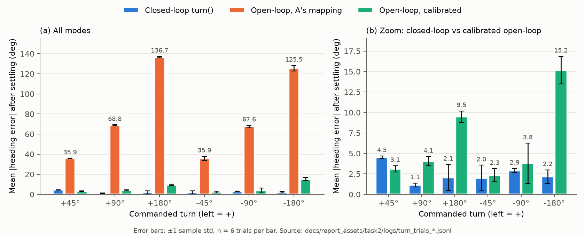

# Task 2 report evidence (turn accuracy, onboard camera + YOLO)

Written by Student B (assist) for Student A's Task 2 evidence, pending review
by Student A. Nothing in `skills/skills_real.py` was changed; every number
below comes from A's `RealSkills` API, called by the new scripts in `tools/`.

All commands run from the repo root, headless (`gui=False`,
`native_viewer=False`), one sim process at a time:

```bash
export QUADRUPED_MUJOCO_ROOT=/home/jiamo/EE4705/quadruped_mujoco   # your clone
```

## 1. Open-loop vs closed-loop turn accuracy (Task 2 motion skills)

| Output | Comes from | Regenerate |
|---|---|---|
| `turn_accuracy_table.md` | `logs/turn_trials_*.jsonl` | `.venv/bin/python tools/task2_turn_report.py` |
| `turn_accuracy.png` | `logs/turn_trials_*.jsonl` | same command (writes both) |
| `logs/turn_trials_left.jsonl` (+ `.console.txt`) | sim run | `eval/run_env.sh tools/task2_turn_trials.py --angles 45 90 180 --trials 6 --modes closed open_A open_cal --run-id left-<stamp> --out docs/report_assets/task2/logs/turn_trials_left.jsonl` |
| `logs/turn_trials_right.jsonl` (+ `.console.txt`) | sim run | same command with `--angles -45 -90 -180 --run-id right-<stamp> --out docs/report_assets/task2/logs/turn_trials_right.jsonl` |

The table and the figure are produced only from the JSONL logs, so they
cannot disagree with each other or with the raw data.

### Method

- **Start condition.** Every trial starts from a settled stand: `stop()`,
  then wait until the yaw peak-to-peak over the trailing 0.5 s of sim time
  is below 0.2° (at least 1.0 s hold, 6 s timeout). Trials are not chained
  on a moving robot.
- **Scoring.** After the command, `stop()` and wait for the same settle
  criterion. `rotation = final yaw - start yaw` on an unwrapped yaw track
  sampled at about 200 Hz from `get_robot_pose()`, so the direction of a
  180° turn is known. `heading error = wrap(rotation - target)`.
  `settle time` = sim time from command end until the yaw last left a ±0.2°
  band around its final value. `wall time` = wall-clock time from command
  start to settled.
- **Closed loop** = `RealSkills.turn(angle)` as A wrote it (P-control on
  `get_robot_pose()` yaw, kp = 1, |wz| ≤ 1, exits when |error| ≤ 2°). Its
  printed `[TURN] ... final_error=` value is also logged
  (`turn_printed_final_error_deg`).
- **Open loop, A's mapping (`open_A`)** = exactly what
  `python -m skills.skills_real --compare-turn` sends:
  `move(0, 0, 0.6, t)` with `t = 1.5 s × angle / 90°`. **Stated mapping:
  wz = 0.6 is assumed to produce 90° / 1.5 s = 60 °/s.** (Nominally the
  policy's wz command is in rad/s, since `cmd_scale[2] = ang_vel_scale =
  0.25`, so 0.6 would be 34.4 °/s. Neither figure matches what the robot does.)
- **Open loop, calibrated (`open_cal`)** = the same single-point,
  linear-in-angle method, but with a measured rate: at the start of the
  same process, 3 × `move(0, 0, 0.6, 4.0 s)` from a settled stand, then
  `r_cal = mean settled rotation / 4.0 s`, and `t = angle / r_cal`.
  This shows what open-loop timing can do when it is calibrated properly.
- Ground truth is used for scoring only. The open-loop commands never read
  the pose.
- The robot turns in place at the spawn point, on flat floor facing +x
  (terrain starts at x ≈ 1.5 m). The logged position drift stayed below
  0.17 m.

### Result

The full table (114 logged turns: 108 trials plus 6 calibration runs) is
**[`turn_accuracy_table.md`](turn_accuracy_table.md)**. It covers 6 targets
(±45°, ±90°, ±180°) × 3 modes × 6 trials. Each trial also has the error that
`turn()` printed itself, the rotation at command end, the settle time and the
wall time. Headline rows (mean |error| ± std after settling, n = 6 each):

| Target | Closed-loop `turn()` | Open-loop, A's mapping | Open-loop, calibrated |
|---|---|---|---|
| +45° | 4.54 ± 0.16 | 35.92 ± 0.14 | 3.11 ± 0.39 |
| +90° | 1.14 ± 0.25 | 68.77 ± 0.48 | 4.07 ± 0.55 |
| +180° | 2.05 ± 1.59 | 136.66 ± 0.71 | 9.49 ± 0.70 |
| −45° | 2.01 ± 1.56 | 35.85 ± 2.16 | 2.35 ± 0.80 |
| −90° | 2.91 ± 0.26 | 67.56 ± 1.26 | 3.79 ± 2.46 |
| −180° | 2.16 ± 0.82 | 125.54 ± 2.82 | 15.18 ± 1.68 |

(This is a copy of the table file's rows. If you re-run the trials, the table
file and the figure update and this copy does not.)

Run conditions: 1-min load average 3.7–10.8 on the 32-core host. Other
agents' sims (`main.py`) were running at the same time. The sim real-time
factor during commands stayed at 0.98–0.99 in every trial, so the load did
not slow the sim noticeably. All 228 settle checks (start and end of each
trial) passed. The lowest trunk height logged was 0.322 m, so the robot never
fell.



**What the data shows**

1. **A's open-loop mapping is off by about 4×.** The command `wz = 0.6`
   produced a mean rate over a 4 s command of **14.3 °/s for left turns and
   18.4 °/s for right turns**. A's mapping assumes 60 °/s, and the nominal
   value is 34.4 °/s if wz is in rad/s. As a result, `open_A` reaches only
   **20–30 % of the target** (errors of 36–137°). This matches A's earlier
   "~25–28 %" finding.
2. **Open-loop timing does extrapolate linearly once the rate is measured.**
   With the measured rate, the errors are 2.3–4.1° at ±45° and ±90°, but they
   grow with angle: 9.5° at +180° and 15.2° at −180°. The robot overshoots
   by 3–8 % at ±90° and ±180° and undershoots by 5–7 % at ±45°, so one rate
   constant cannot absorb the spin-up and spring-back. The rate also depends on turn direction (L 14.3 vs R
   18.4 °/s) and drifted within one calibration (72.1 → 73.8 → 75.4° over
   three identical 4 s runs). So a calibration made for one turn direction
   or one session does not carry over.
3. **Closed-loop `turn()` lands within 1.1–4.5° after settling** at every
   target, with a mean of 2.47° and a maximum of 4.71° over 36 trials. It is
   faster than the calibrated open loop at every target (3.0–5.9 s vs
   5.3–15.3 s wall time per trial including settling), because |wz|
   saturates at 1.0 instead of 0.6. It is **not** better than
   the calibrated open loop at +45° (4.5° vs 3.1°). The reason: `turn()`
   exits as soon as |error| ≤ 2° and prints that value. After the command
   drops to zero, the trunk yaw springs back by about 3° (43.4° at exit,
   40.5° settled). So the `[TURN] final_error` line (mean 1.4–1.8° per
   target) **understates the settled error** at every target except +90°.
   The gap is largest at +45° (1.55 vs 4.54°) and −90° (1.42 vs 2.91°).
4. **`turn(±180)` mostly turns right.** `_wrap_deg(180) = -180`, so
   `turn(+180)` turned clockwise in 6/6 trials and `turn(-180)` in 5/6. The
   final heading is still correct, but a video or report should not call
   these "left 180° turns".

Possible follow-ups for Student A (not done here, since `skills_real.py` is
A's file): add a settle-then-recheck step to `turn()` before it prints
`[TURN]`, and/or have `turn()` report the settled error. Also give an
explicit direction for |angle| = 180°.

## 2. Onboard camera + YOLO screenshots (2.iii) and annotated clip (2.ii)

| Output | Comes from | Regenerate |
|---|---|---|
| `yolo_screenshots/yolo_0[1-6]_*.png` (annotated), `yolo_screenshots/raw/*.png` (unannotated) | `logs/render_evidence_all.json` → `shots` (pose, detections, which graded objects are in the FOV) | `eval/run_env.sh tools/task2_render_evidence.py --part all` |
| `onboard_clip/task2_onboard_yolo_turn.mp4` (H.264, 640×480, 15 fps, 10.0 s, 364 KB) | `logs/render_evidence_all.json` → `clip.frames` (per-frame yaw, pose, detections) | same command |
| `onboard_clip/clip_frames/frame_{000,060,112,149}.png` | same, frames 0/60/112/149 of the clip | same command (`--keep-frames` picks them) |
| `logs/render_evidence_all.console.txt` | console output of that run, including every `[DETECT]` line | same command |

Settings: onboard camera `dog_front_camera` (640×480, fovy 80°, horizontal
FOV 96°, mounted 0.48 m above the floor when standing). Detector
`RealPerception.detect` with the project config: `yolo11n.pt`, conf 0.2,
imgsz 736, plus Student C's HSV colour grounding. Boxes are drawn in the
grounded colour and labelled `class | colour | conf`. The header strip of
each image shows the pose and the detector settings. Load average during the
render run: about 4.

**2.ii clip.** One teleport to (−2.2, 0.0) at yaw 100°. The sim thread is
paused while the pose is written, then the robot settles for 3 s. Then it
turns in place with `move(0, 0, 0.6, 10.5 s)` and every new
`get_camera_frame()` image is recorded. The sweep goes from yaw +99.5° to
−102.7° (158°). YOLO runs after the capture on the recorded frames, so the
GIL-heavy inference cannot slow the real-time sim loop. 150 frames were
captured over 10.4 s of sim time (14.4 Hz average: the 10 ms poll missed a
few renders), and they are encoded at 15 fps, so playback runs about 4 %
fast. Results: at least one detection in 114/150 frames.
- Correct class and colour: orange sports ball in 71 frames, red chair in
  15, green chair in 9.
- Wrong class: "toilet"/"mouse" on the ball in 26 frames, mostly when it is
  cut off at the image edge. "Chair" on a stop sign in 5 frames (green sign
  in frames 146–149, see `frame_149.png`; yellow sign in 1). "Traffic light"
  on a stop sign in 5 frames. "Airplane" on the white stairs/terrain in 3
  frames.
- Detections were matched to objects by comparing each box's bearing with
  the ground-truth object positions. This was done offline, for this README
  only.

**2.iii screenshots.** Taken after the clip with physics frozen: the sim
thread is stopped and the robot stays in its settled standing joint pose. The
trunk is placed at 6 viewpoints at stand height and rendered from the same
onboard camera. Repeatedly teleporting a *live* robot with
`perception.scenarios.place_robot` segfaulted on the 2nd placement, because
it calls `mj_forward` while the sim thread is inside `mj_step`; that is why
physics is frozen here.

| File | Robot (x, y, yaw) | Detected | Graded objects in FOV (ground truth, logging only) |
|---|---|---|---|
| `yolo_01_overview_both_chairs.png` | (0.6, 0, 180°) | red chair 0.62 | all 6. Green chair (3.2 m) missed, the 3 signs missed, ball (4.1 m, mostly behind the red sign's pole) missed |
| `yolo_02_green_chair_1p6m.png` | (−0.9, 0.9, 135°) | green chair 0.66 | green chair, yellow sign (missed) |
| `yolo_03_red_chair_1p6m.png` | (−0.9, −0.9, −135°) | red chair 0.41 | red chair, green sign (missed) |
| `yolo_04_ball_1p6m.png` | (−2.0, 0.5, −162°) | orange sports ball 0.91 | ball, green sign (missed) |
| `yolo_05_green_chair_side_1p6m.png` | (−2.0, 0.4, 90°) | false positive: "airplane" (colour unknown) on the stairs | green chair seen from behind and cropped: missed |
| `yolo_06_yellow_stop_sign_1p8m.png` | (−3.0, 1.0, 146°) | none | yellow stop sign: missed |

The 6 poses were fixed before this run. One earlier attempt, a view from
the spawn point (0, 0, 180°), produced 0 detections because both chairs were
cut off at the image edges. It was replaced by the overview at x = 0.6 m; no
other view was swapped out. The results agree with Student C's larger offline test (`docs/task4_color_grounding.md`):
chairs and the ball are detected with the correct colour, while the scene's
square "+" stop signs are almost never recognised as "stop sign".
`custom_scene.xml`'s objects are still primitive geoms, so the handout's
warning about untextured primitives still applies to the signs.

## 3. Problems found in the earlier Task 2 turn numbers

These are in `docs/test_result/student_a_turn_accuracy_data.md`,
`docs/STUDENT_A_README.md` §2/§6, the bar chart
`docs/test_result/student_a_Bar_chart _or_closed-loop_and_open-loop.png`, and
the `--compare-turn` block in `skills/skills_real.py`. The files are left
unchanged for Student A to decide.

1. **The bar chart shows the superseded numbers.** It plots open-loop
   |error| of about 22.5–24.5° at 90° (6 trials). Those are the old
   absolute-heading values (|112.5 − 90|). The "FINAL" data file gives
   64.0–65.6° for the same 6 trials after the correction. The chart was not
   regenerated, and no script or data source exists to reproduce it.
2. **Closed-loop errors come from two different sources, and neither is the
   settled error.** Collection 1 uses 90 − resulting yaw, with 2 decimals
   (1.88, 1.96, …). Collection 2 uses the 1-decimal `[TURN]` print (1.90,
   1.20, …). Both are the error at loop exit, which is ≤ 2° by construction
   (the tolerance). After settling, +45° actually ends 4.5° short, against
   1.52° in A's table.
3. **The open-loop measurement was taken on a moving robot.** Each step
   started from the unsettled pose just after `turn()` returned, ended the
   moment `move()` returned, and trials were chained back-to-back. A's
   rotations (12.65 / 23.95 / 45.67°) match this run's rotation *at command
   end* (11.2 / 23.4 / 46.9°). But the robot then springs back 2–4°, to
   9.1 / 21.2 / 43.3° settled.
4. **The correction note gives the wrong reason.** It says the
   absolute-heading comparison was valid for "a single, first-ever trial"
   that started at yaw 0. In Collection 1, every open-loop step started at
   about 88° (right after the closed-loop turn), so that comparison was never
   valid for any trial. The corrected numbers themselves are right.
5. **"1.5 s @ wz = 0.6" is not a 90° calibration.** The `--compare-turn`
   comment calls it "calibrated", but A's own data shows it turns about 24°.
   Nominally, 0.6 rad/s × 1.5 s = 51.6°, not 90°. The rate it implies is
   60 °/s; this run measured 14.3 (L) / 18.4 (R) °/s.
6. **The conclusion contradicts the data.** "A single-point calibration
   cannot be extrapolated" does not follow: a constant 25–28 % fraction across
   45/90/180° means linear duration scaling *does* extrapolate. The error is
   in the rate constant. With a measured rate, the same method lands within
   2.3–4.1° at ±45/±90° (and 9.5–15.2° at ±180°).
7. **Smaller issues:**
   - The `STUDENT_A_README.md` §2 summary table says "Overall closed-loop
     (n=24)" but lists only the 18 Collection-2 trials.
   - The `skills_real.py --compare-turn` comment cites
     `docs/turn_accuracy_data.md`, which does not exist.
   - `student_a_ camera_rate_comparison.md` points to
     `docs/camera_evidence/<rate>hz/`, but the files are in
     `docs/test_result/camera_evidence/`, and the clips are named
     `camera_evidence_<rate>hz.mp4` while the script writes
     `camera_evidence.mp4`.
