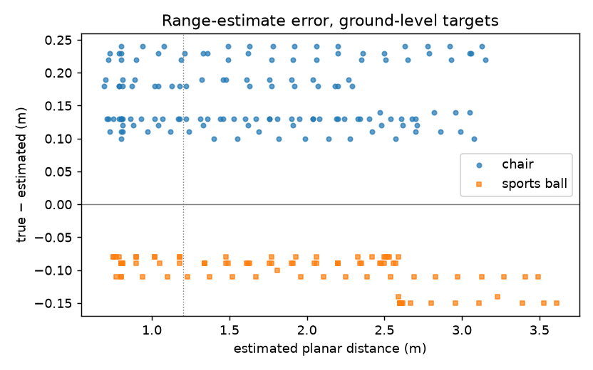

<!-- Written by Student B (assist), pending review by Student C. -->
# Task 4 — C2 stop margin (assist/c2-margin)

**Problem.** "Found" requires (C1) the target detected in the live frame at the stop, (C2) planar distance
≤ 0.80 m (`config.FOUND_DISTANCE_M`) and (C3) the `[FOUND]` line (docs/STUDENT_C_README.md). The approach stopped
as soon as the **estimated** range was ≤ 0.80 m, but the estimate reads short for chairs, so the robot stopped at a
**true** 0.84–0.96 m: `[MISSION] status=SUCCESS` with C2 violated. Ground truth is used here only for logging and
offline evaluation (the `[RANGE] … ground_truth=` log and the e2e trace), never for the decision.

**Recount of the existing trial table** (`docs/test_result/task4_trials_report.csv`, Student C, 2026-10-03):
6/10 marked successful, but only **1/10** is a success with true d ≤ 0.80 m (scenario 2, ball, 0.64 m). The
other five "successes" stopped at 0.87, 0.88, 0.87, 1.05 and 0.97 m.

## Estimate error (before the change)

From the 20 "before" S3 trials (e2e baseline + the P2a run, typed through main.py, same navigation code),
`tools/c2_margin_analysis.py` collects every `[RANGE] estimated_planar=… ground_truth=…` pair. Error e = true − est,
ground-level targets, near band (est ≤ 1.2 m, where the stop decision is made):

| Targets | n pairs | bias (m) | std (m) | p95 (m) |
|---|---|---|---|---|
| all ground-level | 69 | +0.079 | 0.125 | +0.230 |
| chairs | 46 | **+0.164** | 0.045 | +0.237 |
| sports ball | 23 | **−0.090** | 0.011 | −0.080 |
| stop signs (elevated) | 0 | – | – | – (never detected, see docs/task4_stopsign.md) |

The error is strongly class-dependent with a small spread inside each class: chairs read ~16 cm short, the ball
~9 cm long. Raw pairs: `docs/report_assets/c2_margin/before_range_errors.json`.

## Change (minimal)

- `core/config.py`: `FOUND_DISTANCE_M = 0.8` unchanged (the evaluation definition, still used by the stop check
  C2). New `APPROACH_STOP_M = 0.57` (pooled: 0.80 − p95 0.23) and `APPROACH_STOP_M_BY_CLASS = {"chair": 0.56,
  "sports ball": 0.78}` (chair: 0.80 − its p95; ball: its estimate reads long, so stop just inside 0.80, which
  also leaves 2 cm of hysteresis for the stop check).
- `perception/navigation.py`: `_approach_stop_m(object_class)`, used in the two places where the approach decides
  to stop (`goto_object` and `_approach_step`). The post-stop check `_finish_if_found` still requires the
  estimate ≤ `FOUND_DISTANCE_M`, so stop (≤ 0.56 / 0.78) and verification (≤ 0.80) now have hysteresis — the
  0.80-in / 0.80-out flake seen on 2026-10-03 can't recur.
- `tests/test_c2_margin.py`: 6 tests.

A first version used the pooled 0.57 m for every class (v1). It fixed the chairs but broke both ball trials (the
ball ended at 0.33–0.41 m true, leaving the camera's view or being bumped), which is why the margin is per class.

## Before / after (S3, typed through `main.py --scenario N`, fresh launch each, qwen-flash)

Success = `[MISSION] status=SUCCESS` and true d ≤ 0.80 m and C1 (scenario 10: the correct `target_not_found`).

| # | target | before: baseline | before: P2a | after v1 (0.57 all) | after v2 (per class) |
|---|---|---|---|---|---|
| 01 | red chair | ❌ SUCCESS, true d 0.85, 15.4 s | ❌ SUCCESS, true d 0.84, 13.2 s | ✅ SUCCESS, true d 0.69, 29.3 s | ✅ SUCCESS, true d 0.74, 54.0 s |
| 02 | orange sports ball | ✅ SUCCESS, true d 0.66, 28.1 s | ✅ SUCCESS, true d 0.68, 34.7 s | ❌ FAIL timeout, true d 0.33, 120.0 s | ✅ SUCCESS, true d 0.61, 28.3 s |
| 03 | green chair | ❌ SUCCESS, true d 0.94, 13.7 s | ❌ SUCCESS, true d 0.96, 14.1 s | ✅ SUCCESS, true d 0.7, 15.1 s | ✅ SUCCESS, true d 0.68, 16.0 s |
| 04 | red chair | ❌ SUCCESS, true d 0.84, 19.8 s | ❌ SUCCESS, true d 0.88, 19.8 s | ❌ FAIL target_not_found, true d 0.78, 70.9 s | ❌ FAIL stop_verification, true d 0.59, 25.2 s |
| 05 | yellow stop sign | ❌ FAIL target_not_found, true d 3.78, 10.8 s | ❌ FAIL target_not_found, true d 3.78, 11.0 s | ❌ FAIL target_not_found, true d 3.78, 11.0 s | ❌ FAIL target_not_found, true d 3.78, 10.9 s |
| 06 | green stop sign | ❌ FAIL target_not_found, true d 5.04, 10.9 s | ❌ FAIL target_not_found, true d 5.03, 11.4 s | ❌ FAIL target_not_found, true d 5.04, 10.8 s | ❌ FAIL target_not_found, true d 5.04, 10.8 s |
| 07 | orange sports ball | ✅ SUCCESS, true d 0.67, 16.2 s | ✅ SUCCESS, true d 0.69, 16.5 s | ❌ FAIL stop_verification, true d 0.41, 20.6 s | ✅ SUCCESS, true d 0.6, 20.6 s |
| 08 | blue chair | ❌ SUCCESS, true d 0.87, 18.6 s | ❌ SUCCESS, true d 0.89, 14.4 s | ✅ SUCCESS, true d 0.66, 20.8 s | ✅ SUCCESS, true d 0.7, 21.6 s |
| 09 | red stop sign | ❌ FAIL target_not_found, true d 1.27, 11.0 s | ❌ FAIL target_not_found, true d 1.27, 10.8 s | ❌ FAIL target_not_found, true d 1.27, 10.9 s | ❌ FAIL target_not_found, true d 1.28, 10.8 s |
| 10 | blue chair | ✅ FAIL target_not_found, true d None, 11.1 s | ✅ FAIL target_not_found, true d None, 11.0 s | ✅ FAIL target_not_found, true d None, 10.9 s | ✅ FAIL target_not_found, true d None, 10.9 s |
| **strict success** | | **3/10** | **3/10** | **4/10** | **6/10** |
<!-- before: baseline: eval/e2e/results/20261004-0101_baseline -->
<!-- before: P2a: eval/e2e/results/20261004-0111_p2a_task4_via_main -->
<!-- after v1 (0.57 all): eval/e2e/results/20261004-0118_p2b_c2_margin -->
<!-- after v2 (per class): eval/e2e/results/20261004-0128_p2b_c2_margin_v2 -->

Clips: `~/Videos/e2e/<run>/S3_NN.mp4` (run names in the HTML comments above). Per-trial details (search,
DETECT correctness, C1/C2/C3, contacts): each run's `summary.md` under `eval/e2e/results/`.

- **Chairs:** before 0/8 strict (true 0.84–0.96 m); after v2 3/4 at true 0.68–0.74 m. Scenario 4 (red chair
  approached from the side, chairs flanking the ball) failed `stop_verification` at 0.59 m: the last step
  overshot (est 0.67 → 0.48), the chair filled the frame (bbox touching the top edge, conf 0.38) and the stop
  frame missed it (C1). That is the close-range limit of a frame-filling target, not a range error.
- **Ball:** 4/4 before, 0/2 with v1, 2/2 with v2 (true 0.60–0.61 m).
- **Contacts (e2e trace):** v2 had none. v1 bumped the red chair in scenario 4 (at 0.50 m, while re-acquiring)
  and the ball in scenario 2. Independently of the margin, scenario 2's straight path to the ball passes the red
  stop sign at (−1.3, 0), and the P2a and v1 runs brushed its pole: `goto_object` has no obstacle avoidance.
- **Stop signs:** 0/3 in every run — YOLO never labels the square sign plates "stop sign" (7/387 rendered views).
  Not a range problem; see `assist/stopsign`.
- **Time:** unchanged within noise except scenario 1 v2 (54 s, extra re-centring near the chair).

n = 1 trial per scenario per run; the final e2e run (P4) repeats S3 once more with this change.

**Open for Student C:** keep a per-class margin or fix the class-dependent bias in the estimator itself
(`_estimated_planar_distance`); also note the estimator reads the target's height from the simulator
(`_target_center_world_height`, `data.xpos`), i.e. ground truth in the control path — see docs/TEAM_HANDOFF.md.

Regenerate: `python tools/c2_margin_analysis.py eval/e2e/results/20261004-0101_baseline eval/e2e/results/20261004-0111_p2a_task4_via_main --json docs/report_assets/c2_margin/before_range_errors.json --plot docs/report_assets/c2_margin/before_range_errors.png`

## Repeated runs: n = 3 per scenario (added 2026-10-04 03:30)

Two more S3 runs on each side, fresh launch each (baseline = merged-main code; final = `b/overnight-all`, which
includes this branch). Full table: `eval/e2e/S3_n3.md` / `eval/e2e/COMPARISON.md` on `b/overnight-all`.

| Class | Baseline (3 runs) | Final (3 runs) |
|---|---|---|
| chair (scenarios 1, 3, 4, 8) | strict **0/12**: all 12 "SUCCESS" at true 0.83–0.99 m (mean 0.89) | strict **7/12**: 9 SUCCESS at mean 0.76 m (2 still > 0.80 m: scenario 1 after a re-acquire), 3 `stop_verification` (all scenario 4) |
| sports ball (2, 7) | 6/6, mean 0.66 m | 6/6, mean 0.64 m |
| stop sign (5, 6, 9) | 0/9 (never detected) | 0/9 (never detected) |
| **all (incl. 10, absent target)** | **9/30 (30 %)** | **16/30 (53 %)** |

Scenario 3 (green chair) and 8 (blue chair) went from 0/3 to 3/3. Scenario 4 (red chair approached from the side,
"walk over to the red chair") went from three far "SUCCESS" stops (0.84–0.88 m) to three `stop_verification`
failures at 0.57–0.60 m: the last step overshoots and the frame-filling chair isn't confirmed in the stop frame.
That case needs C's verification or step-size change (docs/TEAM_HANDOFF.md, C4), not a different margin.
