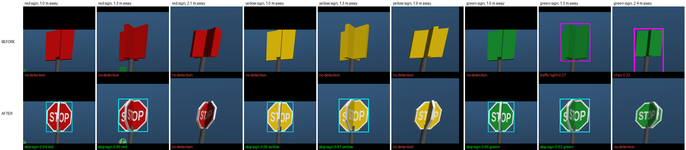

# Task 4: octagonal STOP signs (P2f)

Branch `assist/stopsign`, from merged `main` at `ee9593f`, 2026-10-04. Written by Student B (assist). The scene part
needs review by the group (`assets/scenes/custom_scene.xml` is shared) and the scenario part by Student C.
`perception/navigation.py`, `perception/perception_real.py` and every YOLO or Task 4 setting are unchanged.

## In short

| | before (square "+" plates) | after (octagonal STOP plates) |
|---|---|---|
| sign views labelled "stop sign" by yolo11n (same 387 views) | **7/387 (1.8%)** | **228/387 (58.9%)** |
| sign colour named correctly on those detections | 7/7 | 284/284 |
| chair views detected as "chair" | 314/412 (76%) | **238/413 (58%)** |
| ball views detected as "sports ball" | 117/117 | 115/117 |

Stop-sign targets go from almost never detectable to usually detectable, and colour grounding stays correct.
The cost is that **chair detection drops** in frames where YOLO also sees one of the new signs (see below).
**The group has to choose whether to merge.** My recommendation is at the end.

## What changed

- **Sign model.** Each sign is still a pole plus a "+" cross of two plates at z = 0.85 m. The plates are now
  **regular octagons**, 0.30 m flat to flat (the old squares were 0.30 m wide) and 0.02 m thick. Each one is an inline
  MuJoCo `<mesh name="stopsign_octagon">` with per-vertex texcoords. Both faces map the same texture, mirrored on the back,
  so "STOP" reads correctly from either side. The edges sample the white border. **I used the textured mesh, not
  the fallback** of white letters built from thin boxes. MuJoCo 3.14 accepts inline `texcoord`, and
  `compose_scene` copies the mesh, texture and material and resolves the texture path against the scene file.
- **Textures.** `assets/scenes/textures/stopsign_<colour>.png` is 512×512 and about 22 KB each, with one file for each of
  red, yellow, green, blue, orange, purple and pink. Each is a white-bordered octagon in the sign colour with white
  "STOP" letters (Liberation Sans Narrow Bold, about 1/3 of the sign's height, as on a real sign). The red, yellow and
  green backgrounds are the old `sign_*_mat` rgba values, so the colour the grounding step sees is unchanged.
  `tools/make_stopsign_assets.py` regenerates the PNGs and, with `--mesh`, prints the `<mesh>` element.
- **`assets/scenes/custom_scene.xml`.** The materials keep their names (`sign_red_mat`, `sign_yellow_mat`,
  `sign_green_mat`) and now reference the texture with rgba `1 1 1 1`, because the colour lives in the PNG. The
  positions, the pole and the plate height are unchanged. There's a change note at the top of the file.
- **`perception/scenarios.py` (`build_scene_xml`).** Generated signs use the same mesh, through a new material
  `gen_<colour>_sign_mat` per sign colour. The name keeps the colour token and `sign`, which
  `_find_target_body_id` matches on. Texture paths are made absolute because the scenario XML is written elsewhere.
  Chairs and balls are untouched.
- **Body lookup check.** `tools/check_stopsign_bodies.py` composes each scene the way RealSkills does, without physics
  or a renderer. It covers the default scene and all 10 scenarios. For each one it calls
  `navigation._find_target_body_id` for every `OBJECT_POSITIONS` key and checks that the body is at that key's (x, y).
  Result: **ALL OK**. Every sign, chair and ball is found at its own position, and scenario 10's absent `blue_chair`
  is correctly not found. The mesh geoms have all-positive `geom_size`, so the "2 box-like geoms = stop sign" geometry
  fallback still holds as well.
- **Measurement tool.** `tools/task4_stopsign_eval.py` is a thin wrapper around `tools/task4_color_testset.py`. It
  adds `--scene` and uses MuJoCo's `geom_aabb` for mesh geoms in the visibility box, and it also generates the
  before/after montage.

## How it was measured

The views and settings are those of `tools/task4_color_testset.py` (see `docs/task4_color_grounding.md`): the real
composed scene through `RealSkills(gui=False)`, the 640×480 `dog_front_camera`, and the trunk teleported to 8
bearings × 4 distances around every graded object (tuning set, 210 frames) plus the held-out set (156 frames). YOLO
is `yolo11n.pt` with conf 0.2 and imgsz 736 on CPU, and every detection is kept. Labels come from segmentation masks
(ground truth, **offline only**). A sign view counts as a hit if a "stop sign" detection is labelled as that sign.

The baseline re-render reproduces the earlier numbers exactly: 3/136 red, 2/127 yellow and 2/124 green, so **7/387**.
It also reproduces every chair and ball number in `docs/task4_color_grounding.md`. To keep the comparison like for
like, the "after" rates below are scored on **exactly the 387 frames where the sign was visible in the baseline**.
On its own visibility test (the octagon covers slightly fewer pixels than the square) the new scene scores 223/370.

## Results

### Detection rate per colour (same 387 views)

| Sign | before | after | after, as any class |
|---|---|---|---|
| red | 3/136 (2%) | **92/136 (68%)** | 92/136 |
| yellow | 2/127 (2%) | **74/127 (58%)** | 81/127 |
| green | 2/124 (2%) | **62/124 (50%)** | 66/124 |
| **all** | **7/387 (1.8%)** | **228/387 (58.9%)** | 239/387 |

The split holds on both sets. The tuning set goes from 7/224 to 131/224, and the held-out set (not used for any choice
here) goes from 0/163 to 97/163.

The remaining misses are mostly far away. By sign depth:

| depth | before | after |
|---|---|---|
| < 1.2 m | 7/24 | **24/24** |
| 1.2–1.9 m | 0/69 | **68/69** |
| 1.9–3.0 m | 0/95 | **73/95** |
| ≥ 3 m (background signs) | 0/199 | 63/199 |

The median confidence on sign detections is 0.79, and the 10th percentile is 0.27.

### Colour grounding

Grounding uses `perception_real._grounded_color` as it is on main, unchanged. The white letters and border have
saturation near 0, so its S ≥ 160 filter drops them, and the sign colour still wins.

- "stop sign" detections on a sign: **284/284** name the sign's colour (red 116/116, yellow 86/86, green 82/82).
  Before the change it was 7/7.
- Every detection labelled as a sign, of any class: **297/297**. Before: 80/80.
- Detections on chairs and the ball: 442/442 (before: 548/556).

### Variants tried (same views)

| variant | signs as "stop sign" (387 views) | chairs as "chair" | ball |
|---|---|---|---|
| before: square "+" plates | 7 | 314/412 | 117/117 |
| one octagon plate, facing ±x, STOP text | 188 | 248/413 | 115/117 |
| **two crossed octagons, STOP text (committed)** | **228** | **238/413** | 115/117 |
| two crossed octagons, white border only, no text | 142 | 261/413 | 117/117 |

The crossed pair keeps the original design's property that a face is visible from every direction, and it detects best.
Its perpendicular plate shows as an edge strip through the middle of "STOP", as you can see in the crops, but YOLO
still reads the sign. The octagon shape alone accounts for most of the gain (7 → 142), and the text adds the rest
(142 → 228).

### Before/after crops



`docs/task4_stopsign_crops.png` shows the same view in each column, before on top and after below. For each colour there
are two views the change fixed and the nearest view it still misses (≈ 2 m, seen diagonally). Cyan boxes are "stop
sign" detections and magenta boxes are other classes. Each label gives the class, the confidence and the grounded colour.

## Risks

1. **Chair detection drops when a sign is detected in the same frame.** This was not expected. Split by whether the new
   scene has a "stop sign" detection in the frame:
   - frames with a sign detected: chairs drop from **152/209 to 86/209**;
   - frames without: chairs go from 163/204 to 152/204, roughly unchanged.

   The chair pixels are identical in those frames. For example, in tuning frame 0018 the green chair box's
   confidence falls from 0.43 to 0.07, while the only change is a sign 230 px away that is now detected as "stop
   sign" at 0.72. This looks like a context effect inside yolo11n (its C2PSA block applies attention across the whole coarsest feature map): the primitive box
   chairs are only weakly chair-like, and a convincing street sign in the frame pushes them below conf 0.2. Even the
   text-free octagon causes most of the drop (261/413). In the default scene, the spawn view toward −x contains the
   chairs and the signs together. **Chair targets may need more search time or fail more often.** The per-frame test
   doesn't show that directly, so it needs an end-to-end check.
2. **The floor reflects the signs.** `groundplane` has reflectance 0.2. Nine of the 295 "stop sign" detections are
   the mirrored sign in the floor, with no object pixels in the box. All nine ground to colour **"unknown"**, so they
   can't match a red/yellow/green target. The other two unlabelled "stop sign" boxes are real signs cut off by the frame
   edge, and their colours are correct.
3. **Existing evidence was recorded with the old signs.** Videos, `docs/test_result/task4_trials.csv`, the detection
   section of `docs/task4_color_grounding.md` and any e2e baselines (`eval/e2e`) all show the square plates. After a
   merge they are no longer reproducible as recorded. The report should say which scene version each result used.
4. **Handout and guide constraints.** The official MiniLab 1.3 handout **isn't on disk**. The PDF in
   `/home/jiamo/EE4705/project1.3/` is a different project (VLA humanoid). The repo's guides say:
   - `docs/STUDENT_A_README.md`: *"your own MJCF with ≥3 objects from ≥2 COCO classes, including two same-class
     objects in different colors … Untextured primitives will NOT be detected by YOLO — use real meshes (Objaverse /
     Sketchfab)."*
   - `assets/scenes/README.md`, which quotes the handout: *"A plain colored box will not be detected as a 'chair';
     free meshes can be found on Objaverse or Sketchfab."*

   I found **no constraint on sign shape and no requirement to keep the original objects** in the repo's guides. This
   change keeps the classes, colours, positions and `OBJECT_POSITIONS` keys, and it moves toward the guides' "textured
   or real mesh" advice. **A human should confirm against the official handout.** The plate is a home-made textured
   octagon, not an Objaverse model, so it needs no citation. `custom_scene_meshes.xml` (the Objaverse
   `stop_sign.obj` variant) is untouched.
5. **Minor.**
   - The pole (radius 2.5 cm) pokes about 5 mm through the 2 cm plate at the bottom border.
   - Scenario signs use the default scene's sign colours. For example, red is 0.80/0.05/0.05 against `COLOR_RGBA`'s
     0.80/0.08/0.08, which makes no measurable difference.
   - The plates are mesh geoms with convex-hull collision, which is the same footprint as before.

**Tests.** The full suite gives 95 passed and 6 failed. The same 6 fail with this branch's scene and scenario changes
stashed (`test_handoff::test_main_wires_mocks_by_default` and 5 tests in `test_navigation_reacquire`), so none of them
comes from this change. `python -m perception.scenarios` still validates all 10 scenarios, and a rendered scenario 6
shows textured signs.

## Recommendation

**Merge, but only after one end-to-end check of chair targets.** Without this change, the three stop-sign targets are
detected in under 2% of views and are practically unreachable in Task 4. With it, they're detected at 100% under 1.2 m
and 99% at 1.2–1.9 m, and grounding names the colour 284/284 times. Before merging, run the chair targets of scenarios 1
and 3 (or the e2e S-suite chair cases) with the new scene and compare success and time with the existing baseline. If
chair success clearly drops, the options are:

- (a) use the text-free octagon, which gives fewer sign detections (142/387) but a smaller chair loss (261/413);
- (b) finish the real chair meshes (`custom_scene_meshes.xml`), which should make the chairs robust to context;
- (c) keep the old signs and accept that stop-sign targets fail.

Nothing on `main` changes until someone merges `assist/stopsign`.

## Reproduce

```bash
python tools/make_stopsign_assets.py [--mesh]          # textures (+ mesh element)
git show ee9593f:assets/scenes/custom_scene.xml > assets/scenes/_old_signs.xml
MUJOCO_GL=egl python tools/task4_stopsign_eval.py run --scene assets/scenes/_old_signs.xml --out BASE
MUJOCO_GL=egl python tools/task4_stopsign_eval.py run --out NEW
python tools/task4_stopsign_eval.py report --out NEW --ref BASE
python tools/task4_stopsign_eval.py montage --out NEW --ref BASE --dest docs/task4_stopsign_crops.png
python tools/check_stopsign_bodies.py                  # target-body lookup, default scene + 10 scenarios
```

(Use `eval/run_env.sh` for the platform paths. The runs above used `CUDA_VISIBLE_DEVICES=`, which puts YOLO on the CPU.)

## End-to-end check (added 2026-10-04 01:50 by Student B)

S3 (C's 10 scenarios typed through `main.py --scenario`, fresh launch each) on `b/overnight-all` (which has the
per-class C2 stop margin) **with this branch merged**, against the same code without it
(`eval/e2e/results/20261004-0138_stopsign_eval` vs `20261004-0128_p2b_c2_margin_v2` on `b/overnight-all`):

| | without (square plates) | with octagon STOP signs |
|---|---|---|
| strict success (SUCCESS and true d ≤ 0.80 m and C1) | **6/10** | **5/10** |
| stop-sign targets (5, 6, 9) | 0/3 detected | 2/3 detected; 5 → `SUCCESS` but true d **0.93 m** (elevated target: estimate 0.54 m), 9 → timeout at 1.24 m, 6 not found |
| chairs (1, 3, 4, 8) | 3/4 | 2/4 — scenario 1: red chair lost at ~1 m while signs were also detected, re-acquire strafes walked **into the chair** (true d 0.24 m, ~74 s in contact) |
| balls (2, 7) | 2/2 | 2/2 |

So detection improves but the end-to-end result gets worse: the chair-detection drop seen offline also shows up on
the robot, and elevated signs would need their own range calibration (the stop margin was fitted on ground-level
objects only). **Not merged into `b/overnight-all`.** Options for the group: keep the old signs; or adopt the octagon
and (a) calibrate the stop-sign range estimate, (b) re-check the chair drop with the text-free octagon variant.
